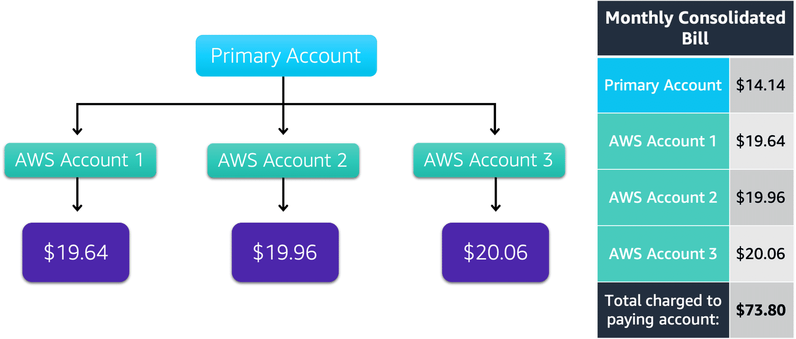

# Consolidated Billing

## Overview

AWS Organizations provides the option for consolidated billing.

The consolidated billing feature of AWS Organizations enables you to receive a single bill for all AWS accounts in your organization. By consolidating, you can easily track the combined costs of all the linked accounts in your organization.

The default maximum number of accounts allowed for an organization is 4, but you can contact AWS Support to increase your quota, if needed.

Another benefit of consolidated billing is the ability to share bulk discount pricing, Savings Plans, and Reserved Instances across the accounts in your organization.

> For instance, one account might not have enough monthly usage to qualify for discount pricing. However, when multiple accounts are combined, their aggregated usage may result in a benefit that applies across all accounts in the organization.

## Example

Suppose that your company has three AWS accounts used for separate departments. Instead of paying each location's monthly bill separately, you decide to create an organization and add the three accounts. 

You manage the organization through the primary account.

Each month, AWS charges your primary payer account for all the linked accounts in a consolidated bill.

The monthly consolidated bill also includes the account usage costs incurred by the primary account. This cost is not a premium charge for having a primary account. 