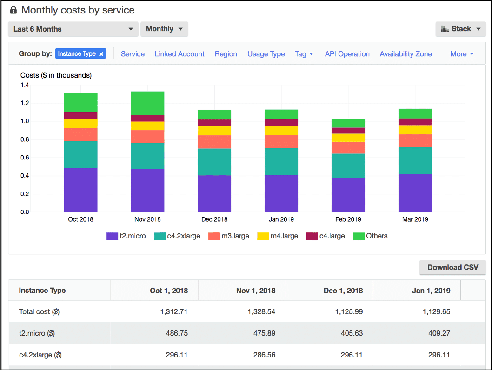

# AWS Cost Explorer

## Overview

AWS Cost Explorer is an easy-to-use tool that allows you to **visualize and analyze your cloud costs**.

You can generate custom reports based on a variety of factors, including resource tags.

Able to break down cost by time range (monthly, hourly), services

Allows you to filter on tags, categories of services, account IDs, etc.

Built-in forecasting up to 12 months.

## Example

This example of the AWS Cost Explorer dashboard displays monthly costs for Amazon EC2 instances over a 6-month period. The bar for each month separates the costs for different Amazon EC2 instance types (such as t2.micro or m3.large). 

## Tips

Think of Cost Explorer whenever the scenario is about budgeting and controlling spend. It works hand in hand with **AWS Budgets**.

Use tags to track your spend. They are one of the most important ways to generate accurate reports and budget spend.

If you're part of an **organization** and have **consolidated billing** in place, the payer account can break down costs per linked account. So you can see just one or two accounts out of your entire organization using that linked account view.
