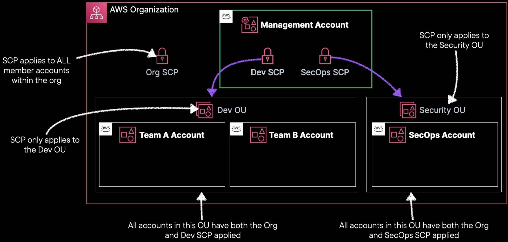

# AWS Organizations

## Overview

AWS Organizations is a free governance tool that hepls you **centrally manage multiple AWS accounts and govern your environment**.

Using a multi-account environment is a recommended best-practice when scaling your cloud environment.

## Features

- **Simplify account creation** by programmatically creating new accounts using the AWS CLI, SDKs, or APIs.
- **Group accounts into organizational units** (OUs), or groups of accounts that serve a single application or service.
- **Apply service control policies** (SCPs) to users, accounts, or organization units to control access to AWS resources, services, and Regions within your organization.
- **Consolidated Billing**: Rolls all bills up to the payer account. Single payment method
- **Set up Single Sign-On** (SSO) to provide access to AWS accounts and resources using your active directory, and customize permissions based on separate job roles.
- **View resources's usage** across accounts and track costs using AWS Cost Explorer and optimize your usage of compute resources using AWS Compute Optimizer.
- **Share AWS resources** across accounts (within your organization) using AWS RAM.
- **Shared Savings**: Easily share Reserved Instances and Savings Plans across the org. *For example, you can share your central AWS Directory Service running on Managed Active Directory with all accounts in your organization, for application to access your central identity store*
- **Apply tag polices** to classify or track resources in your organization and provide attribute-based access control for users or applications.
- Provide central tools to achieve maximum security across accounts
- Delegate responsibility for supported AWS services to accounts so users can manage them on behalf of your organization.
- You can activate CloudTrail across accounts to create logs of all activities in your accounts to keep an eye on accounts for compliance.

## Account types

### Management Account
- Also called the Payer account
- Primary for centralizing governance.
- SCPs do not affect the management account.

### Member Account
- All other AWS accounts that belong to the organization. 
- Can include development accounts, testing accounts, production accounts.

## Consolidated billing

You can use AWS Organizations to set up a single payment method for all the AWS accounts in your organization through consolidated billing.

With consolidated billing, you can see a combined view of charges incurred by all your accounts.

Can also take advantage of pricing benefits from aggregated usage, such as volume discounts for Amazon EC2 and Amazon S3.

Consolidated billing separates paying accounts and linked accounts.

Limit of 20 linked accounts for consolidated billing (default).

Billing alerts can be setup at the paying account which shows billing for all linked accounts.

## Organizational Unit (OU)

A group of AWS accounts within an organization. An OU can also contain other OUs enabling you to create a hierarchy.

## Tag Enforcement

Provides capability to require specific tags is leveraged for all AWS resources.

This ensures consistent tagging practices and it enables better resource categorization and tracking

## Best practices

- Create a centralized logging account for organizational CloudTrail logs.
- Leverage cross-account roles for accessing member accounts
- Plan ahead for the structure of your organization
- Keep the Master Account free of any operational AWS resources
- Apply least privilege practice
- Assign policies to organizational units rather than to accounts
- Test new and modified policies on a single account before scaling up to organizational units.
- Use the APIs and AWS CloudFormation templates to ensure that every newly graded account is configured to your liking

## Examples

We have an AWS organization with a management account and three team accounts in separate OUs. 

We apply an organization-wide service control policy to prevent root user access.

Then, we define specific service control policies for each OU, with different levels of control. These policies only apply to their respective group of accounts.

The development accounts have the development service control policy and the organizational policy, while the security operations account has the security policy and the organizational policy.

This allows for more granular control and simplifies the process.

