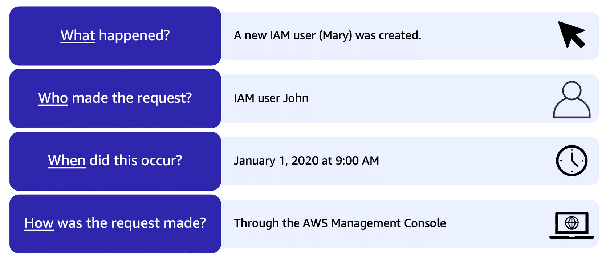

# AWS CloudTrail

## Overview

AWS CloudTrail is a web service that records activity made on your account.

You can identify what happened, who did it, when, and even their IP address.

CloudTrail enables governance, compliance, and operational and risk auditing of your AWS account.

Logs API calls made via:
- AWS Management Console.
- AWS SDKs.
- Command line tools.
- Higher-level AWS services (such as CloudFormation).

A CloudTrail trail can be created which delivers log files to an Amazon S3 bucket.

You can integrate CloudTrail with CloudWatch Logs to deliver data events captured by CloudTrail to a CloudWatch Logs log stream.

CloudTrail log file integrity validation feature allows you to determine whether a CloudTrail log file was unchanged, deleted, or modified since CloudTrail delivered it to the specified Amazon S3 bucket.

## What is logged?

- Metadata around API calls
- The identity of the API caller
- The time of the API call
- The source IP address of the API caller
- The request parameters
- The response elements returned by the service

## Use cases

- Incident investigation. CloudTrail logs can be used to investigate unexpected events in your AWS environment
- Intrusion detection (near real-time). By integrating CloudTrail with Lambda functions, you can create a customizable intrusion detection system
- Industry and regulatory compliance

Suppose that the coffee shop owner is browsing through the AWS Identity and Access Management (IAM) section of the AWS Management Console. They discover that a new IAM user named Mary was created, but they do not who, when, or which method created the user.

To answer these questions, the owner navigates to AWS CloudTrail.

On January 1, 2020 at 9:00 AM, IAM user John created a new IAM user (Mary) through the AWS Management Console.

## Trail

You can create two types of trails for an AWS account:

- A trail that applies to all regions – records events in all regions and delivers to an S3 bucket.
- A trail that applies to a single region – records events in a single region and delivers to an S3 bucket. Additional single trails can use the same or a different S3 bucket.

Trails can be configured to log data events and management events:

- Data events: These events provide insight into the resource operations performed on or within a resource. These are also known as data plane operations.
- Management events: Management events provide insight into management operations that are performed on resources in your AWS account. These are also known as control plane operations. Management events can also include non-API events that occur in your account.

## Event examples

Example data events include:

- Amazon S3 object-level API activity (for example, GetObject, DeleteObject, and PutObject API operations).
- AWS Lambda function execution activity (the Invoke API).

Example management events include:

- Configuring security (for example, IAM AttachRolePolicy API operations).
- Registering devices (for example, Amazon EC2 CreateDefaultVpc API operations).
- Configuring rules for routing data (for example, Amazon EC2 CreateSubnet API operations).
- Setting up logging (for example, AWS CloudTrail CreateTrail API operations).
- CloudTrail log files are encrypted using S3 Server Side Encryption (SSE).

## Encryption

You can also enable encryption using SSE KMS for additional security.

A single KMS key can be used to encrypt log files for trails applied to all regions.

## Multi-account logs

You can consolidate logs from multiple accounts using an S3 bucket:

- Turn on CloudTrail in the paying account.
- Create a bucket policy that allows cross-account access.
- Turn on CloudTrail in the other accounts and use the bucket in the paying account.

## CloudTrail Insights

Within CloudTrail, you can also enable **CloudTrail Insights**. This optional feature allows CloudTrail to automatically **detect unusual API activities** in your AWS account. 

> For example, CloudTrail Insights might detect that a higher number of Amazon EC2 instances than usual have recently launched in your account. You can then review the full event details to determine which actions you need to take next.

## CloudWatch vs CloudTrail

| CloudWatch | CloudTrail |
|---|---|
| Performance monitoring | Auditing |
| Log events across AWS services – think operations | Log API activity across AWS services – think activities |
| Higher-level comprehensive monitoring and events | More low-level granular |
| Log from multiple accounts | Log from multiple accounts |
| Logs stored indefinitely | Logs stored to S3 or CloudWatch indefinitely |
| Alarms history for 14 days | No native alarming; can use CloudWatch alarms |
