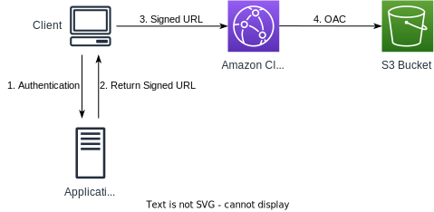

# Access control

## Cloudfront Signed URL / Signed Cookies

CloudFront signed URLs and signed cookies allow you to control who can access your content.

When creating CloudFront Signed URL / Cookie, we need to attach a policy with:
- Includes URL expiration
- Includes IP ranges to access the data from
- Trusted signers (which AWS accounts can create signed URLs)

Signed URLs provide access to individual files. Useful when your users are using a client that doesn't support cookies.

Signed Cookies provide access to multiple restricted files. Useful when you don't want to change your current URLs.

### Signers

There are two types of signers you can use to create signed URLs and signed cookies:

**Trusted Key Groups** (recommended):
- A trusted key group is a collection of public keys that you create and manage in CloudFront.
- You generate your own public & private key:
    - The private key is used by your applications (e.g. EC2) to sign URLs
    - The public key (uploaded) is used by CloudFront to verify URLs
- You can leverage APIs to create and rotate keys

**AWS Accounts**:
- An AWS account that contains a CloudFront key pair.
- You use the private key from the key pair associated with the AWS account to sign URLs or cookies.
- You neet to manage keys using the root account (not recommended) and AWS console
- No API support

**To create a key group**:
1. Open CloudFront Console.
2. In **Public keys** section in the left navigation, add your public key.
3. Navigate to **Key Groups**.
4. Create Key Group:
   - Name your key group.
   - Select public keys.

Once the key group is created, you can reference it in one or more cache behaviors.

### CloudFront signed URLs vs S3 presigned URLs

They are both used to grant temporary access to private content.

CloudFront Signed URL:
- Used to restrict access to content served through a CloudFront distribution.
- Allows access to a specific path, regardless of the origin (S3 or custom origin).
- Can specify IP ranges, start and end times, and use wildcards in paths.
- Uses an account-wide key pair managed by the root user to sign.
- Expiration is defined in the policy with absolute terms (milliseconds from epoch).
- Revocation: Requires distrusting the key pair used for signing.
- Conclusion: CloudFront signed URLs are more flexible with additional controls like IP restrictions and wildcard paths, making them suitable for complex access scenarios

S3 Presigned URLs:
- Used to grant temporary access to objects stored in an S3 bucket.
- Acts as if the request is made by the IAM user who signed the URL.
- Limited to specifying the bucket and object keys.
- Uses IAM key of the signing IAM principle.
- Has limited lifetime, defined relative to the signing time (in seconds).
- Revocation: Requires revoking permissions from the IAM user or removing their access keys.
- Conclusion: S3 presigned URLs are simpler and directly tied to IAM user permissions, making them easier to manage for straightforward access needs.

## Geo Restrictions

You can restrict who can access your distribution based on the country where they try:
- Allowlist: Allow your users to access your content only if they're in one of the countries on a list of approved countries.
- Blocklist: Prevent your users from accessing your content if they're in one of the countries on a list of banned countries.

The "country" is determined using a 3rd party Geo-IP database.

Use case: Copyright Laws to control access to content.

There are two options available for geo-restriction:
- Use the CloudFront Geo Restriction feature for restricting access to **all files** in a distribution and at the country level.
- Use a 3rd party geo-location service for restricting access to a **subset of files** in a distribution and for finer granularity at the country level.

To enable CloudFront Geo Restriction:
1. Open the CloudFront console.
2. Select your distribution.
3. Go to **Security** tab
4. Under **CloudFront geographic restriction** and click **Edit**.
5. Choose **Allow List** or **Block List**.
6. Select countries to allow or block.
7. Save changes.
