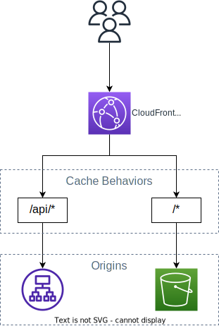

# Cache Behaviors

## Caching Overview

Only GET & HEAD requests are cached (not PUT, POST, PATCH, DELETE).

You can cache dynamic content (from a custom HTTP backend, for example).

You want to maximize the Cache Hit ratio to minimize requests to the origin.

Methods of improving the cache hit ratio include:
- Use the `Cache-Control: max-age=???` directive to control how long objects remain in the cache
- Forward only the query string parameters for which your origin will return unique objects.
- Configure CloudFront to forward only specified cookies instead of forwarding all cookies.
- Configure CloudFront to forward and cache based on only specified headers instead of forwarding and caching based on all headers.
- Use Origin Shield.

## Cache Key

Cache Key is a unique identifier for every object in the cache.

By default, it consists of **hostname** + **resource portion** of the URL. For example: `mywebsite.com/content/example-story.html`.

You can add other elements (HTTP headers, cookies, query strings) to the Cache Key using **CloudFront Cache Policies**.

## Cache Policy

You can use Cache Policy to specify what values in request are included in the Cache Key:
- HTTP Headers: None, Whitelist
- Cookies: None, Whitelist, Include All-Except, All
- Query Strings: None, Whitelist, Include All-Except, All

You can also control the TTL (0 second to 1 year) to define how long objects stay in the CloudFront cache.

You can create your own policy or use Predefined Managed Policies.

All HTTP headers, cookies, and query strings that you include in the Cache Key are automatically included in origin requests.

## Origin Request Policy

Origin Request Policies specify values that you want to include in origin requests without including them in the Cache Key (no duplicated cached content)

You can include:
- HTTP headers: None, Whitelist, All
- Cookies: None, Whitelist, All
- Query Strings: None, Whitelist, All

You can add new CloudFront HTTP headers and Custom Headers to request too.

## Cache Behaviors

The Cache Behaviors section in Distribution page allow you to configure different settings for a given URL path pattern. 

You can route to different kind of origins/origin groups based on the content type or path pattern. For example:
- `/images/*`
- `/api/*`
- `/*` (default cache behavior)

When adding additional Cache Behaviors, the Default Cache Behavior is always the last to be processed and is always `/*`.

## Origin Request URI

The URI of requests sent to your origin will include the path pattern.

For example, if a client requests `https://your-distribution.cloudfront.net/api/users`, CloudFront will forward the request to the origin as `/api/users`.

You can use [CloudFront Functions](./functions.md) to customize the requests sent to your origins, such as rewriting the URI, headers, and query string