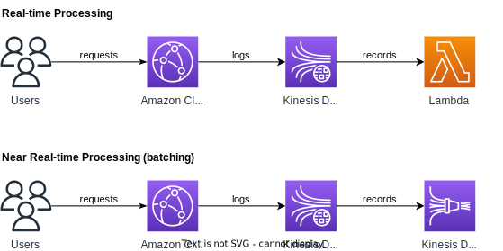

# Monitoring

## Metrics

### Default metrics

You can view operational metrics about your CloudFront distributions and Lambda@Edge functions in the CloudFront console.

Metrics included (no cost):

- **Requests**: The total number of viewer requests received by CloudFront, for all HTTP methods and for both HTTP and HTTPS requests.
- **Bytes downloaded**: The total number of bytes downloaded by viewers for GET, HEAD, and OPTIONS requests.
- **Bytes uploaded**: The total number of bytes that viewers uploaded to your origin with CloudFront, using POST and PUT requests.
- **4xx error rate**: The percentage of all viewer requests for which the response’s HTTP status code is 4xx.
- **5xx error rate**: The percentage of all viewer requests for which the response’s HTTP status code is 5xx.
- **Total error rate**: The percentage of all viewer requests for which the response’s HTTP status code is 4xx or 5xx.

### Additional metrics

You can enable additional metrics for an additional cost.

These additional metrics must be enabled for each distribution separately:

- **Cache hit rate**: The percentage of all cacheable requests for which CloudFront served the content from its cache. HTTP POST and PUT requests, and errors, are not considered cacheable requests.
- **Origin latency**: The total time spent from when CloudFront receives a request to when it starts providing a response to the network (not the viewer), for requests that are served from the origin, not the CloudFront cache. This is also known as first byte latency, or time-to-first-byte.
- **Error rate by status code**: The percentage of all viewer requests for which the response’s HTTP status code is a particular code in the 4xx or 5xx range. This metric is available for all the following error codes**: 401, 403, 404, 502, 503, and 504.

## Real Time Logs

Enable yous to send all requests received by CloudFront to a Kinesis Data Stream in real time.

You can monitor, analyze, and take actions based on content delivery performance.

Configurable options:
- Sampling Rate - percentage of requests for which you want to receive
- Specific fields and specific Cache Behaviors (path patterns) to send to Kinesis Data Stream

## Auditing

CloudFront is integrated with CloudTrail.

CloudTrail captures information about all API calls make to CloudFront.

CloudTrail can be used to determine which requests were made, the source IP address, who made the request etc.

CloudTrail saves logs to the S3 bucket you specify.

S3 buckets can be configured to create access logs and cookie logs which log all requests.

Amazon Athena can be used to analyze access logs.

To view CloudFront API requests in CloudTrail logs you must update an existing trail to include global services.
