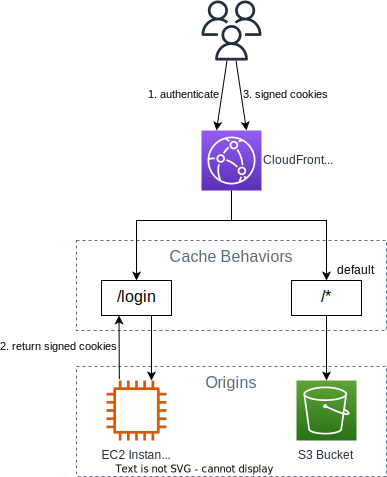

# Scenarios

## Grant access to S3 bucket

CloudFront can be used to grant users access to S3 bucket.

1. User hit the `/login` page and is directed to an EC2 instance
2. The EC2 instance generate a CloudFront signed cookies and return it to the user.
3. User will then use the signed cookies to any other URL, which route to the S3 bucket
4. To protect the S3 bucket, we can set up the cache behavior to only accept the request if signed cookies are present and require user to login first.