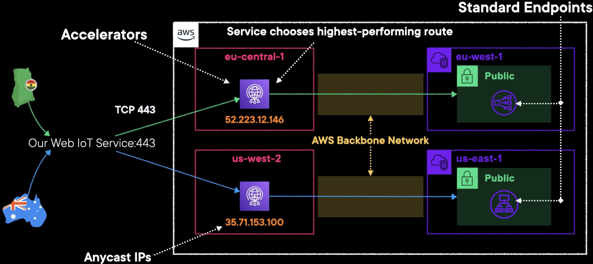

# AWS Global Accelerator (GA)

## Overview

AWS Global Accelerator is a networking service that improves the availability and performance of applications by optimizing traffic from users to your applications.

Uses AWS global network to optimize user traffic, only for TCP and UDP.

It can increase performance and help deal with **IP caching**.

Provides static IP addresses that act as a fixed entry point to your application endpoints.

GA continually monitors the health of your application endpoints, perform seamless failover without changing the IPs.

Health checks for TCP only – not UDP.

GA uses edge locations to speed things up.

Keywords: IP caching, optimizing traffic, reduce latency.

## Concepts

**Accelerator**: Directs user traffic to the optimal AWS endpoints. It acts as the entry point for incoming traffic and helps improve the performance and availability of the applications

**Listener**: Processes inbound connections based on ports and protocols.

**Endpoint**: Resources that Global Accelerator directs traffic to, can be:
- Application Load Balancers
- Network Load Balancers
- Amazon EC2 instances in single or multiple regions

## How it work?

GA gives you 2 any-cast static IPv4 addresses (serviced by independent network zones) that you can use to route traffic to resources in any region

In case of using dual-stack IP addressing, it provides 4 static IP addresses, 2 IPv4 and 2 IPv6.

GA static addresses are spread across different AWS points-of-presence (POPs) in over 30 countries. Users connecting to a static address are automatically routed to the nearest POP.

The GA listener receives the TCP or UDP connection, and then proxies it to the resources you’ve specified in an endpoint group.

## Controlling traffic

GA offers you two accelerator types to control how your traffic is actually directed:
- **Standard**: GA chooses the healthiest closest endpoint for your traffic.
- **Custom**:
  - use application logic to directly map one traffic
to a specific EC2 instance among many different destinations.
  - useful when you have an application that requires groups of users to interact with each other via the same session (gaming application, etc.).

### Fine-grained traffic control

GA gives you the option to dial up or dial down traffic to a specific AWS Region by using traffic dials.

The traffic dial lets you easily do performance testing or blue/green deployment testing for new releases across different AWS Regions.

If an endpoint fails, AWS Global Accelerator assigns user traffic to the other endpoints, to maintain high availability.

By default, traffic dials are set to 100% across all endpoint groups so that AWS Global Accelerator can select the best endpoint for applications.

## Security

AWS Global Accelerator is protected by AWS Shield Standard by default, which minimizes application downtime and latency from DDoS attacks by using always-on network flow monitoring and automated in-line mitigation.

You can also enable AWS Shield Advanced for automated resource-specific enhanced detection and mitigation, as well as 24×7 access to the AWS DDoS Response Team (DRT) for manual mitigations of sophisticated DDoS attacks.

## GA vs. CloudFront

CloudFront is meant to be a content delivery network service
focused on content caching and distribution via HTTP and HTTPS,

Global Accelerator is tailored for optimizing network traffic and routing via TCP and UDP.

They function at different layers.

## Architecture example

In the right side, we have different endpoints present across two distinct regions in the world.

AWS Global Accelerator creates two global accelerators for us to use, leveraging a point of presence or an edge networking location via the CloudFront network.

We are assigned two Anycast IP addresses that can be used within our routing logic and our DNS configuration.

We can map these IP addresses to our web IoT service, which listens on port 443 using TCP and UDP connections.

Two different elastic load balancer types, which are natively supported via standard endpoints, are present on the right-hand side. 

We have users in different countries like Ghana and Australia. Whenever they make their request to our web service using port 443,Global Accelerator automatically handles the load balancing of traffic and directs traffic to the most optimized endpoint.

The traffic is sent through the AWS Backbone network. The networking performance is incredibly high.

