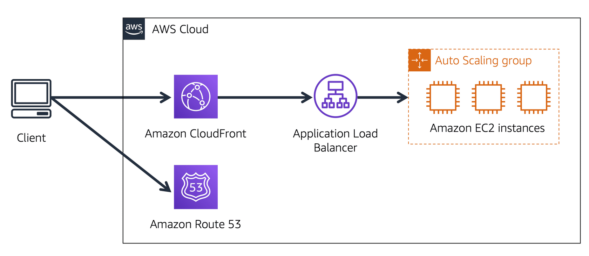

# Amazon Route 53

## Overview

Amazon Route 53 is Amazon's DNS service.

It offers the following functions:
- Domain name registry.
- DNS resolution.
- Health checking of resources.

Supports IPv4 and IPv6.

Located alongside all edge locations.

Primarily uses UDP port 53 (can use TCP).

AWS offer a 100% uptime SLA for Route 53.

You can extend an on-premises DNS to VPC.

You can control management access to your Amazon Route 53 hosted zone by using IAM.

Can be used to route Internet traffic for domains registered with another domain registrar (any domain).

You cannot extend Route 53 to on-premises instances.

There is a default limit of 50 domain names, but this can be increased by contacting support.

Private DNS is a Route 53 feature that lets you have authoritative DNS within your VPCs without exposing your DNS records (including the name of the resource and its IP addresses) to the Internet.

Fun fact: Route 53 is named after Route 66 (one of the original highways across the United States) but is called 53 because DNS operates on port 53.

## Route 53 Traffic Flow

Traffic flow policies allow you to oute traffic based on specific constraints, including latency, endpoint health, load, geo-proximity, and geography.

It's a way of doing very highly complex routing of your DNS traffic, you built it out using a GUI.

You can build your traffic routing policies from scratch or you can pick a template from a library and then customize it.

Amazon Route 53 Traffic Flow also includes a versioning feature that allows you to maintain a history of changes to your routing policies, and easily roll back to a previous policy version using the console or API.

Scenarios include:
- Adding a simple backup page in Amazon S3 for a website.
- Building sophisticated routing policies that consider an end user’s geographic location, proximity to an AWS region, and the health of each of your endpoints.

## Changing name servers

To make Route 53 the authoritative DNS for an existing domain without transferring the domain: create a Route 53 public hosted zone and change the DNS Name Servers on the existing provider to the Route 53 Name Servers.

Changes to Name Servers may not take effect for up to 48 hours due to the DNS record Time To Live (TTL) values.

## Transfering domains

You can transfer domains to Route 53 only if the Top-Level Domain (TLD) is supported.

You can transfer a domain from Route 53 to another registrar by contacting AWS support.

You can transfer a domain to another account in AWS however it does not migrate the hosted zone by default (optional).

It is possible to have the domain registered in one AWS account and the hosted zone in another AWS account.

## Amazon Route 53 and Amazon CloudFront 

Suppose that AnyCompany's application is running on several Amazon EC2 instances. These instances are in an Auto Scaling group that attaches to an Application Load Balancer. 

1. A customer requests data from the application by going to AnyCompany's website. 
1. Amazon Route 53 uses DNS resolution to identify AnyCompany.com's corresponding IP address, 192.0.2.0. This information is sent back to the customer. 
1. The customer's request is sent to the nearest edge location through Amazon CloudFront. 
1. Amazon CloudFront connects to the Application Load Balancer, which sends the incoming packet to an Amazon EC2 instance.