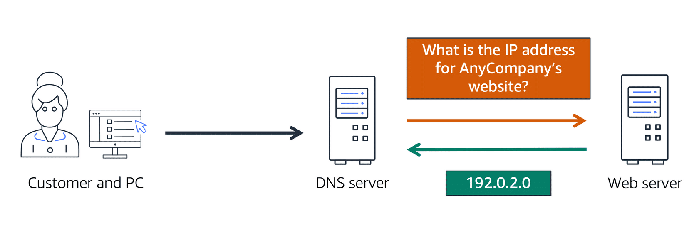

# DNS Concepts

## DNS resolution

DNS resolution is the process of translating a domain name to an IP address. 

## Top-level domains

The last word in a domain name represents the top-level domain.

The second word in a domain name is known as a second-level domain name (this is optional, though, and depends on the domain name).

Example: `.co.uk`, `.co` is the second level, the top level is `.uk`.

Top-level domain names are controlled by the Internet Assigned Numbers Authority (IANA) in a root [zone database](http://www.iana.org/domains/root/db), a database of all available top-level domains.

## Naked domains

A naked domain is a domain name that does not include a subdomain such as `www`. For example, if your website is hosted at `example.com`, then `example.com` is the naked domain.

Naked domains are often used for the root domain of a website, while subdomains are used for specific pages or sections of the website

## Domain Registrars

A registrar is an authority that can assign domain names directly under one or more top-level domains.

These domains are registered with InterNIC, a service of ICANN, which enforces uniqueness of domain names across the internet.

Each domain name becomes registered in a central database known as the WHOIS database.

## Time to live (TTL)

TTL is the length that a DNS record is cached.

The lower the time to live, the faster changes to DNS records take to propagate throughout the internet.
