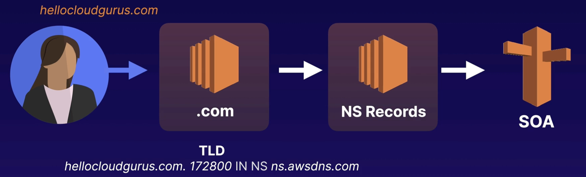

# DNS Records

## Overview

DNS records are stored in zone files on DNS servers.

## Supported DNS record types

Amazon Route 53 currently supports the following DNS record types:

- A (address record).
- AAAA (IPv6 address record).
- CNAME (canonical name record).
- CAA (certification authority authorization).
- MX (mail exchange record).
- NAPTR (name authority pointer record).
- NS (name server record).
- PTR (pointer record).
- SOA (start of authority record).
- SPF (sender policy framework).
- SRV (service locator).
- TXT (text record).
- Alias (an Amazon Route 53-specific virtual record).

## SOA records

It stores information about a domain or zone:

- The name of the server that supplied the data for the zone
- The administrator of the zone
- The current version of the data file
- The default number of seconds for the time-to-live file on resource records

## NS records

NS records are used by top-level domain servers to direct traffic to the content DNS server that contains the authoritative DNS records.

In other words, the NS records **indicate which DNS server is authoritative for a domain** and contains the actual DNS records. The authoritative DNS server is responsible for providing the IP address of the domain name to the requesting client.

Route 53 supports wildcard entries for all record types, except NS records.

## A records

You use an A record to route traffic to a resource, such as a web server, using an IPv4 address in dotted decimal notation.

For example, http://www.acloud.guru might point to http://123.10.10.80.

## AAAA record type

You use an AAAA record to route traffic to a resource, such as a web server, using an **IPv6 address** in colon-separated hexadecimal format.

Example value: `2001:0db8:85a3:0:0:8a2e:0370:7334`

## CNAME records

A CNAME (canonical name) can be used to resolve one domain name to another.

Cannot be used for naked domain names (zone apex record). You can't have a CNAME for http://acloudguru.com

You can't create a CNAME record at the zone apex.

A CNAME record can’t be used for resolving apex / naked domain names.

## Alias records 

The Alias record is a Route 53 specific record type.

Alias records are used to map resource record sets in your hosted zone to:
- Amazon Elastic Load Balancing load balancers
- Amazon CloudFront distributions
- AWS Elastic Beanstalk environments
- Amazon S3 buckets that are configured as websites.

You can use Alias records to map custom domain names to:
- API Gateway custom regional APIs
- edge-optimized APIs
- Amazon VPC interface endpoints

The Alias is pointed to the DNS name of the service.

Alias records work like a CNAME record in that you can map one DNS name to another "target" DNS name.

An Alias record can be used for resolving apex / naked domain names (e.g. `example.com` rather than `sub.example.com`). A CNAME record can’t.

You cannot set the TTL for Alias records for ELB, S3, or Elastic Beanstalk environment (uses the service’s default).

Generally use an Alias record where possible.

## Alias vs. CNAME

| CNAME Records | Alias Records |
|---|---|
| Route 53 charges for CNAME queries | Route 53 doesn’t charge for alias queries to AWS resources |
| You can’t create a CNAME record at the top node of a DNS namespace (zone apex) | You can create an alias record at the zone apex (however you can’t route to a CNAME at the zone apex) |
| A CNAME record redirects queries for a domain name regardless of record type | Route 53 follows the pointer in an alias record only when the record type also matches |
| A CNAME can point to any DNS record that is hosted anywhere | An alias record can only point to a CloudFront distribution, Elastic Beanstalk environment, ELB, S3 bucket as a static website, or to another record in the same hosted zone that you’re creating the alias record in |
| A CNAME record is visible in the answer section of a reply from a Route 53 DNS server | An alias record is only visible in the Route 53 console or the Route 53 API |
| A CNAME record is followed by a recursive resolver | An alias record is only followed inside Route 53. This means that both the alias record and its target must exist in Route 53 |
