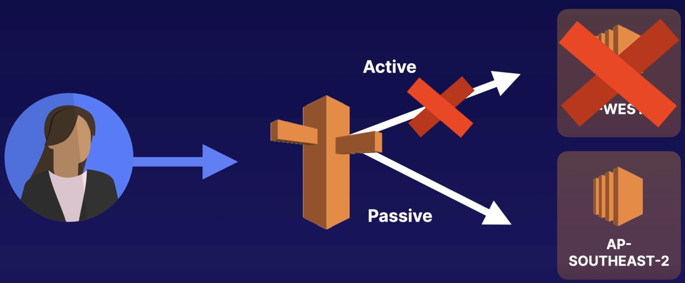
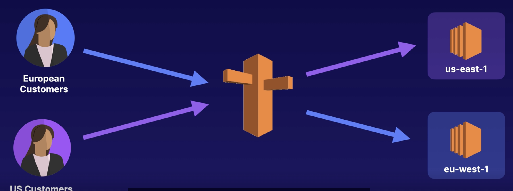

# Routing Policices

## Simple Routing Policy

An A record is associated with one or more IP addresses.

Uses round robin.

Does not support health checks.

## Weighted Routing Policy

Allows you to split your traffic based on different weights assigned.

You create records that have the same name and type and assign each record a relative weight.

To stop sending traffic to a resource you can change the weight of the record to 0.

> For example, you can set 10% of your traffic to go to `us-east-1` and 90% to go to `eu-west-1`.

## Failover Routing Policy

Failover to a secondary IP address.

Used to create an active/passive set up.

Associated with a health check.

Routes only when the resource is healthy.

When used with Alias records set `Evaluate Target Health` to `Yes` and do not use health checks.

Can be used with ELB.

*In this example Route53 will send the traffic to AP-SOUTHEAST-2
because it has detected a failure in EU-WEST-2:*

## Geolocation Routing Policy

Send traffic based on the geographic location of your users (i.e., the location from which DNS queries originate).

Geolocation can be used for localizing content and presenting some or all your website in the language of your users.

Can also protect distribution rights.

Can be used for spreading load evenly between regions.

If you have multiple records for overlapping regions, Route 53 will route to the smallest geographic region.

You can create a default record for IP addresses that do not map to a geographic location.

*For example, you might want all queries from Europe to be routed to a fleet of C2 instances that are specifically configured for your European customers. These servers may have the local language of your European customers and display all prices in euros.*

## Geoproximity Routing

Geoproximity routing lets Amazon Route 53 route traffic to your resources based on the geographic location of your users and your resources.

A bias value can optionally be used to choose to route more traffic or less to a given resource. A bias expands or shrinks the size of the geographic region from which traffic is routed to a resource.

Only available when built with Traffic Flow.

## Latency Routing Policy

Route your traffic based on the lowest network latency for your end user (i.e., which region will give them the fastest response time).

To use latency-based routing, you create a **latency resource record set** for the EC2 (or ELB) resource in each region that hosts your website.

When Route 53 receives a query for your site, it selects the latency resource record set for the region that gives the user the lowest latency.

## Multi-value Answer Routing

Lets you configure Amazon Route 53 to return multiple values in response to DNS queries.

You can specify multiple values for almost any record.

Route 53 returns only values for healthy resources.

This is similar to simple routing; however, it allows you to put health checks on each record set.