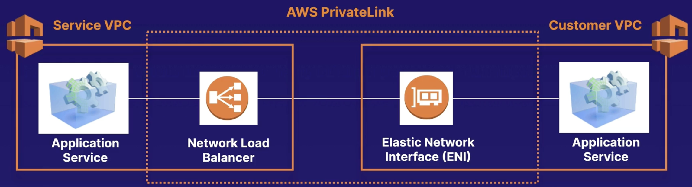

# VPC to VPC

## VPC Peering

Allows you to connect 2 VPCs via a direct network route using private IPv4 addresses or IPv6 addresses.

Instances behave as if they were on the same private network.

Peering is one to one. No transitive peering.

You can peer between regions and accounts.

Data sent between VPCs in different regions is encrypted (traffic charges apply).

For inter-region VPC peering there are some limitations:
- You cannot create a security group rule that references a peer security group.
- Cannot enable DNS resolution.
- Maximum MTU is 1500 bytes (no jumbo frames support).
- Limited region support.

Peered VPCs must not have overlapping CIDR blocks.

There is no single point of failure for communication or a bandwidth bottleneck.

DNS is supported.

Must update route tables to configure routing.

Must update the inbound and outbound rules for VPC security group to reference security groups in the peered VPC.

The VPC peering connection can be added to route tables – shows as a target starting with "pcx-".

## VPC Endpoints

Allow connect your VPC to AWS services without leaving the Amazon internal network.

They are horizontally scaled, redundant, and highly available VPC components that **allow communication between instances in your VPC and services** without imposing availability risks or bandwidth constraints on your network traffic.

Do not require public IP addresses for instances in VPC.

There're two types of VPC Endpoints:
- **Interface endpoint**: is an elastic network interface with a private IP address, serves as an entry point for traffic headed to another AWS services. Support a large number of AWS services.
- **Gateway endpoints**: similar to NAT gateways, is a virtual device you provision. Support S3 and DynamoDB.

## AWS PrivateLink

AWS PrivateLink provides private connectivity between VPCs, AWS services, and on-premises applications, securely on the Amazon network.

No need for public IP address, VPC peering, route tables, NAT gateways, internet gateways, etc.

Requires a Network Load Balancer on the service VPC and an ENI on the customer VPC.

