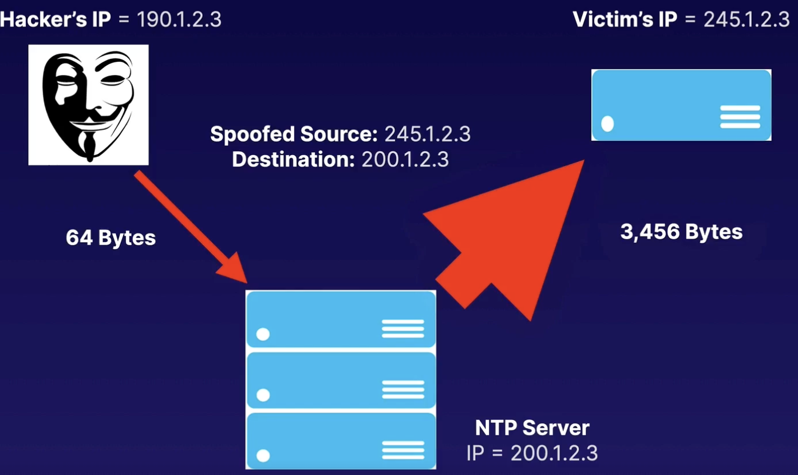

# Denial-of-Service Attacks

## Denial-of-Service Attacks (DoS)

A denial-of-service (DDoS) attack is a deliberate attempt to make a website or application unavailable to users.

> For example, an attacker might flood a website or application with excessive network traffic until the targeted website or application becomes overloaded and is no longer able to respond.

If the website or application becomes unavailable, this denies service to users who are trying to make legitimate requests.

## Distributed Denial-of-Service Attacks (DDoS)

In a distributed denial-of-service (DDoS) attack, multiple sources are used to start an attack that aims to make a website or application unavailable.

This can come from a group of attackers, or even a single attacker. The single attacker can use multiple infected computers (also known as "bots") to send excessive traffic to a website or application.

## Layer 7 Attack

A Layer 7 attack occurs where a web server receives a flood of GET or POST requests, usually from a botnet or a large number of compromised computers.

## Layer 4 DDoS Attack

### SYN Floods

**3-way handshake**:

To establish a TCP connection a 3-way handshake takes place. The client sends a SYN packet to a server, the server replies with a SYN-ACK, and the client then responds to that with an ACK.

After the "3-way handshake" is complete, the TCP connection is established. After this applications begin sending data using Layer 7 (application layer protocol), such as HTTP etc.

**SYN Floods**:

A Layer 4 DDoS attack is often referred to as a SYN flood. It works at the transport layer (TCP).

A SYN flood uses the built in patience of the
TCP stack to overwhelm a server by sending a large number of SYN packets and then ignoring the SYN-ACKs returned by the server.

This causes the server to use up resources waiting for a set amount of time for the anticipated ACK that should come from a legitimate client.

**What can happen?**

There are only so many concurrent TCP connections that a web or application server can have open, so if an attacker sends enough SYN packets to a server, it can easily eat through the allowed number of TCP connections.

This then prevents legitimate requests from being answered by the server.

### Amplification Attacks

An **amplification attack** is a type of **distributed denial-of-service (DDoS)** attack in which an attacker sends a large number of requests to a server or network using a spoofed IP address. The server or network responds to these requests with a much larger response, overwhelming the target and causing it to crash or become unavailable. 

One specific type of amplification attack is the **DNS amplification attack**. In this attack, the attacker sends DNS look-up requests to open DNS resolvers, crafting the requests in such a way that they return responses up to 50 times larger than the requests. 

Amplification attacks are one of the most common DDoS attack vectors. These attacks are typically categorized as flooding or volumetric attacks, where the attacker succeeds in generating more traffic than the target can process, resulting in exhausting its resources due to the amount of traffic it receives.

Amplification/reflection attacks can include things such as NTP (Network Time Protocol to sync clock), SSDP, DNS, CharGEN, SNMP attacks, etc.

