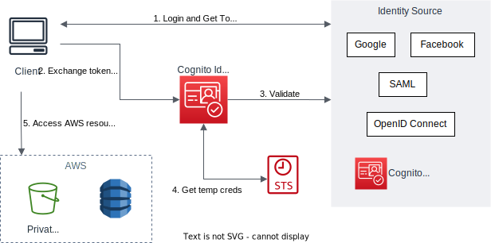

# Identity Pools

## Overview

Identity Pools (Federated Identities) allow you to give your users access to AWS services.

Identity Pool is for authorization (access control).

It allow users to log in from:
- Public Providers (Amazon, Facebook, Google, Apple)
- Amazon Cognito user pool
- OpenID Connect Providers & SAML Identity Providers
- Developer Authenticated Identities (custom login server)

Identity Pool also allow unauthenticated guess access.


## How it work

Users exchange their identity with Identity Pools for temporary AWS credentials.

AWS credentials are obtained by Cognito Identity Pools through STS (Security Token Service).

Once users obtained AWS credentials, they can then access AWS services directly or through API Gateway.



Identity Pools can integrate with user pools or other identity providers. Here's how:
1. You're logging into your app
2. The app connects to a **User Pool** in Cognito for authenticating and getting **tokens**.
3. Your device exchange that token to an **Identity Pool** for **AWS credentials**.
4. You use AWS credentials to access your AWS services.


## Role

We can define default IAM roles for authenticated and guest users.

We can define rules to choose the role for each user based on the user's ID.

The IAM roles must have a "trust" policy of Cognito Identity Pools.


## Policy

IAM policies applied to the credentials are defined in Cognito. 

We can leverage policy variables to customize IAM policies based on the `user_id` for fine grained control.

Here's an IAM policy that allows listing objects in an S3 bucket with prefix matches the user's unique identity ID:
```json
{
  "Version": "2012-10-17",
  "Statement": [
    {
      "Effect": "Allow",
      "Action": "s3:ListBucket",
      "Resource": "arn:aws:s3:::YOUR_BUCKET_NAME",
      "Condition": {
        "StringLike": {
          "s3:prefix": [
            "{cognito-identity.amazonaws.com:sub}/*"
          ]
        }
      }
    }
  ]
}
```
- `${cognito-identity.amazonaws.com:sub}` is a policy variable that represents the unique identifier for the authenticated user.

Or we can use this policy, which has the same effect with above:
```json
{
  "Version": "2012-10-17",
  "Statement": [
    {
      "Effect": "Allow",
      "Action": "s3:ListBucket",
      "Resource": "arn:aws:s3:::YOUR_BUCKET_NAME/{cognito-identity.amazonaws.com:sub}/*"
    }
  ]
}
```