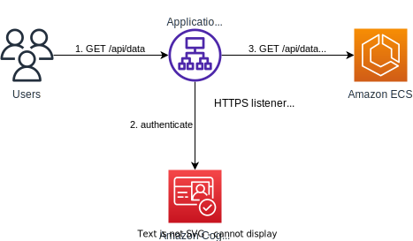
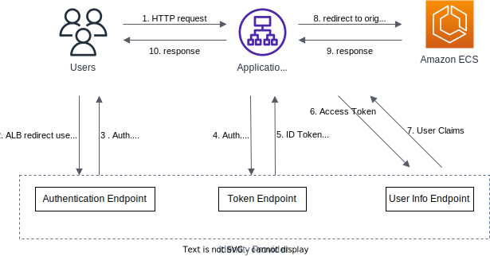

# User Pools

## Overview

User Pools are user directories that provide sign-up, sign-in, access control for your web and mobile application.

User Pools is used for authentication. It support various methods including email, phone number, federate login through Public Social (Google, Facebook), OIDC, SAML...

It offer advanced security features such as:
- multi-factor authentication (MFA)
- password policies
- password reset
- email & phone number verification
- block users if their credentials are compromised elsewhere
- account recovery options

User Pools are designed to scale to millions of users, making them suitable for applications of all sizes.

You can customize the web UI, including sign-up and sign-in, with custom CSS and logo.

You can trigger AWS Lambda during the authentication flow.

Integrated with API Gateway and & Application Load Balancer.

The sign-in experience adapts to risk levels, balancing security and convenience. Low-risk sign-ins proceed smoothly, while higher-risk attempts require additional verification.

## How it work?

When user log in with User Pool, they get back a JWT, and use that token to authenticate with the application.

## Lambda Triggers

User Pools can invoke a Lambda function synchronously on events.

Authentication events:
1. **Pre Authentication**: Validate user credentials before authentication.
2. **Post Authentication**: Execute custom logic after user authentication.
3. **Pre Token Generation**: Modify tokens before they are generated.

Sign-Up:
1. **Pre Sign-up**: Validate or modify user attributes before the user signs up.
2. **Post Confirmation**: Perform actions after a user confirms their registration.
3. **User Migration**: Migrate users from an existing user directory to Cognito.

Messages:
1. **Custom Message**: Customize the messages sent to users, such as verification codes.

## Authentication UI

Cognito has a hosted authentication UI that you can add to your app to handle signup and sign-in workflows.

Using the hosted UI, you have a foundation for integration with social logins, OIDC or SAML

You can customize the UI with a custom logo and custom CSS.

To host the UI on a custom domain, you must create an SSL certificate managed by AWS Certificate Manager (ACM) in `us-east-1`. The custom domain must be defined in the "App Integration" section.

## Adaptive Authentication

Adaptive Authentication is a feature that enhances security by dynamically adjusting authentication requirements based on the risk level of each sign-in attempt.

If the sign-in appears suspicious, based on the risk level (High, Medium, Low, or No Risk), different actions can be configured, such as allowing the sign-in, requiring multi-factor authentication (MFA), or blocking the sign-in.

Risk score is based on different factors such as if the user has used the same device, location, or IP address.

You can configure adaptive authentication settings from the "Advanced security" section.
 
Amazon Cognito publishes metrics about sign-in attempts, their risk levels, and failed challenges to Amazon CloudWatch.

## JWT structure

CUP issues JWT tokens in Base64 encoded format.

Each JWT consists of three parts: the header, the payload, and the signature, separated by periods.

The signature must be verified to ensure the JWT can be trusted.

The Payload contain the user information (sub UUID, given_name, email, phone_number, attributes...).

## Integrations

### Application Load Balancer

Application Load Balancer can securely authenticate users.

It helps offload the work of authenticating users from the application to load balancer. Your applications can focus on their business logic

You can authenticate users through:
- Identity Provider (IdP): OpenID Connect (OIDC) compliant
- Cognito User Pools:
  - Social Identity Providers, such as Amazon, Facebook, or Google
  - Corporate identities using SAML, LDAP, or Microsoft AD

You must use an HTTPS listener for your load balancer, and set authenticate-oidc & authenticate-cognito rules.

In case user is unauthenticated, you can:
- require user to authenticate
- deny request
- allow request

Below is a diagram illustrating user authentication with Cognito User Pools:

For authentication using Identity Provider with OIDC compliant, check this [guide](https://docs.aws.amazon.com/elasticloadbalancing/latest/application/listener-authenticate-users.html#authentication-flow):

