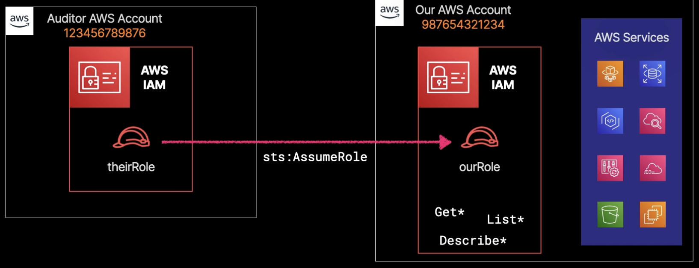

# Setting Up Cross-Account Role Access

## Overview

As the number of AW'S accounts you manage increases, you'll need to set up cross-account access.

Duplicating IAM accounts creates a security vulnerability.

Cross-account role access gives you the ability to set up temporary access you can easily control.

## When to use?

Anytime you have a scenario where a temporary employee or an external person
needs access to an account, you really should avoid using permanent credentials
like access keys. Immediately looking for roles
and specifically cross-account roles if one account needs access to another.

It will always be preferred to create
and leverage cross-account IAM roles
instead of using duplicate long-term IAM users
in each account.

Role assumption is temporary. Their credentials will expire
based on the amount of time you've set for that role.

## Example

For example, we assume the need for a third-party auditor to access our AWS accounts for an audit.

The primary requirements are: 
1. the audit team needs read-only access to our account
2. they have their own AWS account

We create a new role with minimal privileges based on the principle of least privilege access, granting the audit team read-only access. 

We update the trust policy attached to our role to allow the auditor account's role to assume our role. This involves specifying an ARN provided by the audit team and configuring actions to assume a role via our STS API. Optionally, a conditional block can be added for an extra security layer, such as an external ID. 

The third step is providing our role's ARN to the audit team.

After setting up their permissions policy, the fourth step is testing. The audit team assumes our role, becoming our role, and their AWS API calls now operate in our account, ensuring proper permissions for the audit process.

## Benefits

This solution provides a secure method of cross-account access.

No need for long-term access keys or IAM users. Instead, we get rolling, temporary credentials that can be revoked as needed.