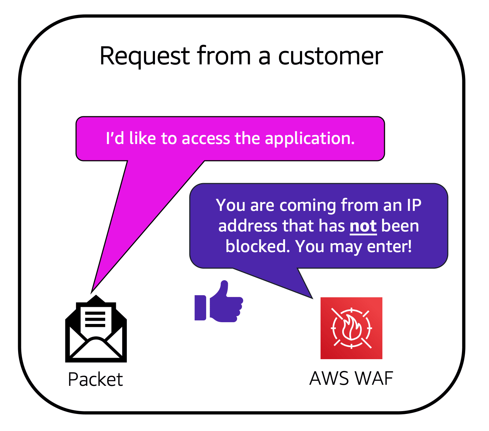

# AWS Web Application Firewall

## Overview

AWS Web Application Firewall (WAF) is a **web application firewall** that lets you **monitor HTTP/HTTPS requests** that are forwarded to **Amazon CloudFront or Application Load Balancer**. 

It helps protect web applications from attacks by allowing you to configure **rules that allow, block, or monitor (count) web requests** based on conditions that you define.

WAF can block:
- Layer 7 DDoS attacks
- SQL injections
- Cross-site scripting.
- Access to specific countries
- Matching of IPv4 and IPv6 address ranges

## Features

Filter web traffic based on strings that appear in the requests using string match conditions.

Centralizing of rule management. Allow creating a single set of rules and reuse across applications.

Provides real-time metrics and captures raw requests.

Integrated with **Amazon CloudWatch**, easy to setup custom alarms when thresholds are exceeded, or attacks occur.

Integrated with **Amazon CloudFront**, supports custom origins outside of AWS, allow protection of web sites not hosted in AWS. Rules run in all AWS Edge Locations, avoid performance overheat.

AWS WAF can be deployed and provisioned with **AWS CloudFormation**, allow to describe all security rules for your application.

When you use AWS WAF on an **Application Load Balancer**, your rules run in region and can be used to protect internet-facing (and internal) load balancers.

## How it works

When AWS services receive requests for web sites, the requests are forwarded to AWS WAF for inspection against defined rules.

Once a request meets a condition defined in the rules, AWS WAF instructs the underlying service to either block or allow the request based on the action you define.

## Configurations

It allows 3 different behaviors:
- **Allow** all requests except the ones you specify.
- **Block** all requests except the ones you specify.
- **Count** the requests that match the properties you specify.

You can define conditions by matching values in the following request parts:
- HTTP Header
- HTTP methods
- Query string
- Body
- Single query parameter (value only)
- All query parameters (values only)
- IP addresses that requests originate from
- Country that requests originate from
- Presence of SQL code that is likely to be malicious (SQL injection)
- Presence of a script that is likely to be malicious (cross-site scripting)
- Strings that appear in requests - either specific strings or strings that match regular expression (regex) patterns

## Pricing

Pricing is based on:
- number of rules you deploy
- number of requests your web application receives

No upfront commitments.
