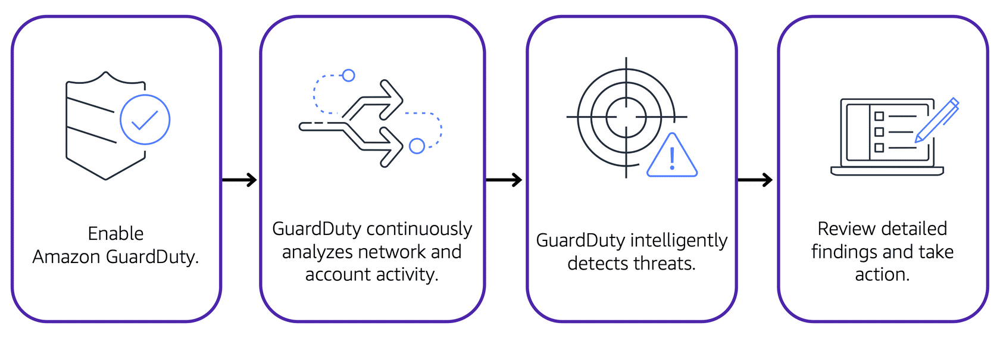

# Amazon GuardDuty

## Overview

GuardDuty is a **threat detection** service that uses machine learning to **continuously monitor for malicious behavior**.

It takes 7-14 days to set a baseline (to know what is normal behavior on your account)

It's looking for things like:
- Unusual API calls
- Unauthorized deployments
- Compromised instances
- Reconnaissance by would-be attackers
- Port scanning, failed logins

## Features

- Alerts appear in the GuardDuty console and CloudWatch Events
- Receives feeds from third parties like Proofpoint and CrowdStrike, as well as AWS Security, about known malicious domains and IP addresses, etc.
- Monitors CloudTrail logs, VPC Flow Logs, and DNS logs
- Centralize threat detection across multiple AWS accounts
- Automated response using CloudWatch Events and Lambda
- Machine learning and anomaly detection

## Setting Up

After you have enabled GuardDuty for your AWS account, GuardDuty begins monitoring your network and account activity.

Once active, you will see findings on the GuardDuty console and in CloudWatch Events only if GuardDuty detects behavior it considers a threat. Findings include recommended steps for remediation.

> You can also configure AWS Lambda functions to take remediation steps automatically in response to GuardDuty's security findings.

## Pricing

You get 30 days free. Charges based on:
- Quantity of Cloud Trail events
- Volume of DNS and VPC Flow Logs data