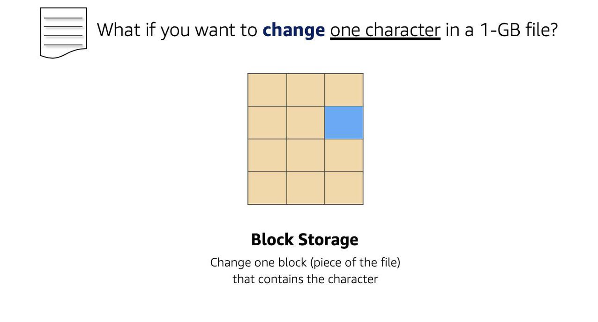
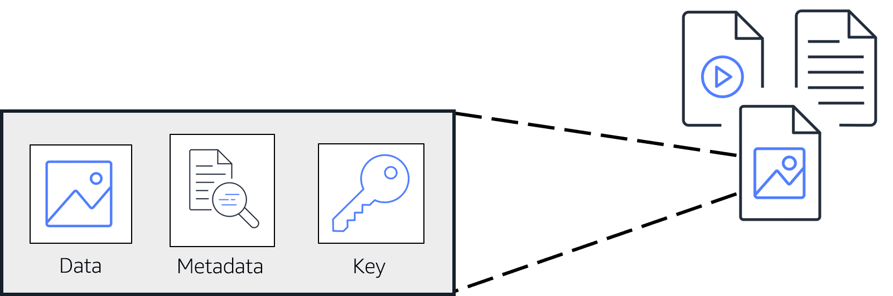
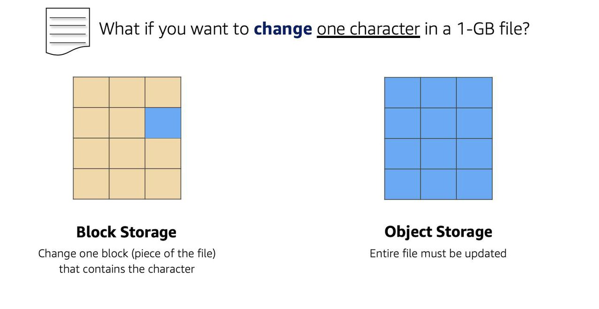

# Storage overview

## Block Storage

While file storage treats files as a singular unit, block storage splits files into fixed-size chunks of data called **blocks** that have their own addresses. Since each block is addressable, blocks can be retrieved efficiently.

When data is requested, these addresses are used by the storage system to organize the blocks in the correct order to form a complete file to present back to the requestor.

**When you want to change a character in a file, you just change the block, or the piece of the file, that contains the character.** This ease of access is why block storage solutions are fast and use less bandwidth.

Since block storage is optimized for low-latency operations, it is a typical storage choice for high-performance enterprise workloads, such as databases or enterprise resource planning (ERP) systems, that require low-latency storage.

## Object Storage

In object storage, each object consists of data, metadata, and a key.

The **data** might be an image, video, text document, or any other type of file. Unlike file storage, these objects are stored in a flat structure instead of a hierarchy.

**Metadata** contains information about what the data is, how it is used, the object size, and so on.

An object's **key** is its unique identifier.

When a file in object storage is modified, the entire object is updated.

Object storage is generally useful when storing large data sets, unstructured files like media assets, and static assets, such as photos.

## File Storage

In file storage, multiple clients can access data that is stored in shared file folders. 

You place your files in a tree-like hierarchy that consists of folders and subfolders. 

Each file has metadata such as file name, file size, and the date the file was created. The file also has a path, when you need to retrieve a file, your system can use the path to find it in the file hierarchy.

Ideal when a large number of services and resources need to access the same data at the same time.

Common use cases for file storage include:
- Large content repositories
- Development environments
- User home directories

### NFS

Network File System. A distributed file system protocol that allows a user on a client computer to access files over a computer network much like local storage is accessed

### NAS

Network attached storage. A centralized file server that allows multiple users to store and share files over a TCP/IP network via Wi-Fi or an Ethernet cable.

### SMB

Server Message Block. A client/server protocol that governs access to files and whole directories, as well as other network resources like printers, routers or interfaces open to the network. 

## IOPS and Throughput

### IOPS

- Measures the number of read and write operations per second.
- Important metric for quick transactions, low-latency apps, transactional workloads.
- The ability to action reads and writes very quickly.

The speed of your database storage is limited by the number of IOPS allocated to it.

To understand how many IOPS you need, you first need to know the amount of data you can transfer in a single I/O operation (disk throughput). For example:
- MySQL and MariaDB have a page size of 16 KB. Hence, writing 16 KB of data to disk would constitute one I/O operation
- Oracle, PostgreSQL, and Microsoft SQL Server use a page size of 8 KB. Writing 16 KB of data using one of those database engines would consume two I/O operations.

### Throughput

- Measures the number of bits read or written per second (MB/s)
- Important metric for big data, data warehousing, ETL, large I/O sizes, complex queries
- The ability to deal with large datasets

## Storage Types

- **Persistent data store**: Data is durable and sticks around after reboots, restarts, or power cycles	(S3, Glacier, EBS, EFS)
- **Transient Data Store**: Data is just temporarily stored and passed along to another process or persistent store	(SQS, SNS)
- **Ephemeral Data Store**: Data is lost when the system is stopped	EC2 Instance Store, Memcached (Elasticache)
