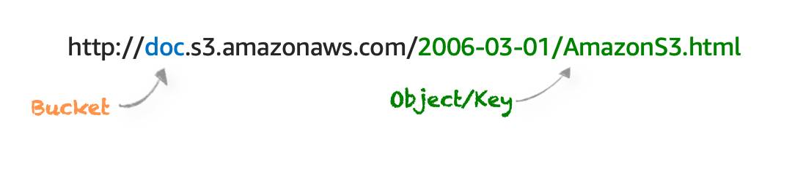

# Amazon S3

## Overview

Amazon S3 is a service that provides object-level storage.

Objects are redundantly stored across AZs in a region.

It offers unlimited storage space.

It can not be used to run an operating system or database.

Files can be from 0 bytes to **5 TB**.

Consistency model:
- Provides **strong read-after-write** consistency for PUTS of new objects: object is immediately available for reading after written.
- Provides eventual consistency for overwrite PUTS and DELETES (takes time to propagate).

## Use cases

- **Backup and storage**
- **Application Hosting**: Provide services that deploy, install, and manage web applications.
- **Media hosting**: Build a redundant, scalable, and highly available infrastructure that hosts video, photo, or music uploads and downloads.
- **Software delivery**: host your software applications that customers can download.
- **Static websites hosting**

## Object

S3 object is made up of:

- Key (name).
- Value (data).
- Version ID.
- Metadata.
- Access Control Lists.

You can define permissions on objects.

## Bucket

Amazon S3 store your objects in containers called buckets.

A bucket is a flat container of objects. It does not provide a hierarchy of objects but you can use an object key name (prefix) to mimic folders.

**Bucket name** must be unique globally.

An S3 bucket is region specific.

**100** buckets per account by default.

Bucket names cannot be changed after they have been created.

If a bucket is deleted its name becomes available again.

## Sub-resources

Sub-resources are subordinate to objects, they do not exist independently but are always associated with another entity such as an object or bucket.

Sub-resources associated with buckets include:
- Lifecycle – define an object’s lifecycle.
- Website – configuration for hosting static websites.
- Versioning – retain multiple versions of objects as they are changed.
- Access Control Lists (ACLs) – control permissions access to the bucket.
- Bucket Policies – control access to the bucket.
- Cross Origin Resource Sharing (CORS).
- Logging.

Sub-resources associated with objects include:
- ACLs – define permissions to access the object.
- Restore – restoring an archive.

## S3 Outposts

Delivers object storage to your on-premises AWS Outposts environment

Store data durably and redundantly across multiple devices and servers on your Outposts

Ideal for workloads with local data residency requirements that requires keeping data close to on-premises applications.

## S3 Copy

You can create a copy of objects up to **5GB** in size in a single atomic operation.

Can be performed using the AWS SDKs or REST API.

Use cases:
- Generate additional copies of objects.
- Renaming objects.
- Changing the copy's storage class or encryption at rest status.
- Move objects across AWS locations/regions.
- Change object metadata. Once uploaded to S3 some object metadata cannot be changed, copying the object can allow you to modify this information.

## Static Websites

S3 can be used to host static websites.

URL format: `<bucketname>.s3-website-.amazonaws.com`.

Supports publicly readable content only.

Only supports GET and HEAD requests on objects.

You can use a custom domain name with S3 using a Route 53 Alias record (the bucket name must be the same as the domain name).

Can enable redirection for the whole domain, pages, or specific objects.

Does not support HTTPS/SSL.

To enable website hosting on a bucket, specify:
- An Index document (default web page).
- Error document (optional).

## Object Tags

S3 object tags are key-value pairs applied to S3 objects which can be created, updated, or deleted at any time during the lifetime of the object.

Allow you to create IAM policies, setup S3 Lifecycle policies, and customize storage metrics.

Up to **10** tags can be added to each S3 object.
