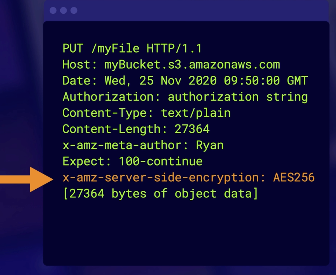

# Encryption

## In Transit

You can securely upload/download your data to Amazon S3 via SSL endpoints using the HTTPS protocol (In Transit – SSL/TLS).

## At rest (Server-Side Encryption)

Service-side encryption is now enabled by default.

All objects are automatically encrypted by using server-side encryption with Amazon S3 managed keys.

If you need server-side encryption for all the objects that are stored in a bucket, use a bucket policy.

### Server-Side Encryption options

**SSE-S3**:
- S3 manages the keys.
- AWS manage encryption and decryption for you
- Each object is encrypted with a unique key.
- Encryption key is encrypted with a master key.
- AWS regularly rotate the master key.
- Uses AES 256.

**SSE-KMS**:
- use Customer Master Keys (CMKs) provided by AWS KMS or your own key.
- provides added protection against unauthorized access of objects with separate permissions for the use of a CMK
- provides you with an audit trail that shows when your CMK was used and by whom.

**SSE-C**:
- Client-provided keys.
- S3 manages the encryption/decryption
- If keys are lost data cannot be decrypted.

### Enforcing Server-Side Encryption for S3 Uploads (legacy use cases)

When uploading a file to S3, we're essentially sending a PUT request.

To enforce service side encryption we've got two different options:
1. Add header `x-amz-server-side-encryption: AES256` (use S3-managed keys) to the PUT request
2. Add header `x-amz-server-side-encryption: aws:kms` (use KMS-managed keys ) to the PUT request

Now you can create a bucket policy that denies any S3 PUT request that doesn't include the `x-amz-server-side-encryption` parameter in the request header.

## Client-side encryption

Encrypt objects using your own local encryption process before uploading to S3.

To enable client-side encryption, you have the following options:
- Use a customer master key (CMK) stored in AWS KMS.
- Use a master key you store within your application.

## KMS Limitations

If you are using **SSE-KMS** to encrypt/decrypt your objects in S3, you must keep in mind the KMS limits.

Uploading/downloading will count toward the **KMS quota**.

You can't request a quota increase for KMS. You might want to consider using the native bult-in S3 encryption than KMS.

> When you upload a file, you will call `GenerateDataKey` in the KMS API. When you download a file, you will call `Decrypt` in the KMS API.

The KMS's limits is Region-specific. (5,500 or 10,000 or 30,000 requests per second). This makes your upload/download much slower when reaching the limits.

## Instructions

To enable S3 encryption in the AWS Management Console, follow these steps:

1. Open the Amazon S3 console.
2. Choose the bucket that you want to encrypt.
3. Choose the **Properties** tab.
4. Choose **Default encryption**.
5. Choose **Edit**.
6. In the **Default encryption** dialog box, specify the following:
    - **Encryption**: The type of encryption you want to use.
    - **Master key**: The master key that you want to use for encryption.
7. Choose **Save changes**.
