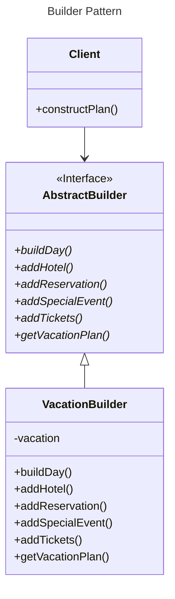

# Builder

## Overview

Use the Builder Pattern to encapsulate the construction of a product and allow it to be constructed in steps.


## Benefits

Encapsulates the way a complex object is constructed.

Allows objects to be constructed in a multistep and varying process (as opposed to one-step factories).

Hides the internal representation of the product from the client.

Product implementations can be swapped in and out because the client only sees an abstract interface.


## Use Cases

Often used for building composite structures.


## Drawbacks

Constructing objects requires more domain knowledge of the client than when using a Factory.


## Example

We have to build a vacation plan for our guests.

Guests can can choose a hotel and various types of admission tickets, make restaurant reservations, and even book special events.

A vacation plan have multiple days. Each day can have any combination of hotel reservations, tickets, meals, and special events.

Each guest's plan can vary in the number of days and types of activities it includes.

To create a vacation plan, you need to be able to create structures like this:
```
Plan
  DayOne
    Hotel
    Park Tickets
    Dining
      Dinner
  DayTwo
    Hotel
    Park Tickets
    Special Event
      Patterns on Ice
    Dining
      Dinner
  DayThree
    Park Tickets
    Hotel
    Special Event
      Cirque Du Patterns
```

You need to follow a sequence of potentially complex steps to create the plan.

### Requirements

You need to provide a way to create the complex structure without mixing it with the steps for creating it.

### Solution

We encapsulate the creation of the trip plan in an object (let's call it a builder), and have our client ask the builder to construct the trip plan structure for it.



The client uses an abstract interface `AbstractBuilder` to build the plan.

The Client directs the builder to create the plan in a number of steps and then calls the `getVacationPlan()` method to retrieve the complete object:
```tsx
class Client {
  constructPlan() {
    builder.buildDay(date);
    builder.addHotel(date, "Grand Facadian");
    builder.addTickets("Patterns on Ice");
    
    // plan rest of vacation
    Plan yourPlan = builder.getVacationPlan();
  }
}
```

The concrete builder `VacationBuilder` creates real products and stores them in the vacation composite structure.