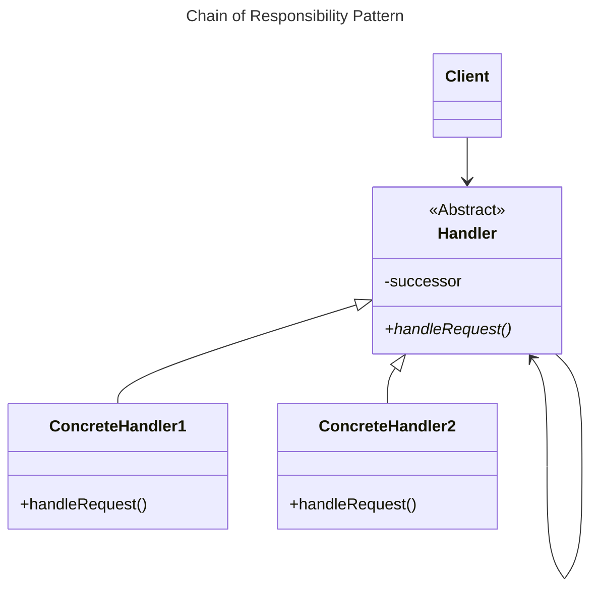
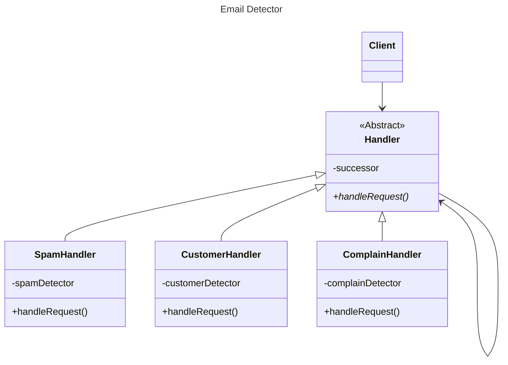

# Chain of Responsibility

## Overview

Use the Chain of Responsibility Pattern when you want to give more than one object a chance to handle a request.


## Structure



With the Chain of Responsibility Pattern, you create a chain of objects to examine requests. Each object in turn examines a request and either handles it or passes it on to the next object in the chain.

Each object in the chain acts as a handler and has a successor object. If it can handle the request, it does; otherwise, it forwards the request to its successor.


## Benefits

Decouples the sender of the request and its receivers.

Simplifies your object because it doesn't have to know the chain's structure and keep direct references to its members.

Allows you to add or remove responsibilities dynamically by changing the members or order of the chain.


## Use Cases

Commonly used in Windows systems to handle events like mouse clicks and keyboard events.


## Drawbacks

Execution of the request isn't guaranteed; it may fall off the end of the chain if no object handles it (this can be an advantage or a disadvantage).

Can be hard to observe and debug at runtime.


## Example

You have to design that can use different email detectors to handle incomming email:
- customer's mail should go straight to the CEO
- complaints should go to the legal department
- requests for new products should go to business development
- spam should be deleted.

Each email detector can detect one kind of email, and there'll be more detectors added later.


### Solution



We have an abstract class that define the interface for all email handlers `Handler`.

A handler will store a reference to the next handler (`successor`) in the chain.

Each concrete email handler will have its own detector to check if it can handle an email.
```ts
class SpamHandler {
  constructor(successor, detector) {
    this.detector = detector;
    super(successor);
  }
  
  handleRequest(email) {
    if (this.detector.isSpam(email)) {
      moveToSpam();
    } else {
      this.successor.handleRequest(email);
    }
  }
}
```

As email is received, it is passed to the first handler: `SpamHandler`. If the `SpamHandler` can't handle the request, it is passed on to the `CustomerHandler`. And so on...

Email is not handled if it falls off the end of the chain, although you can alway implement a catch-all handler.
