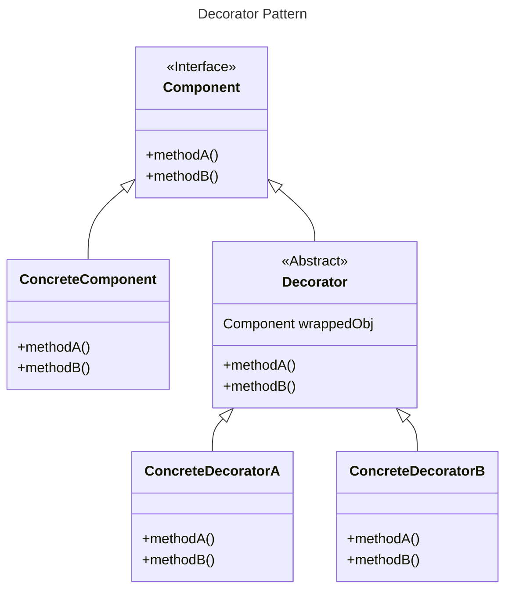
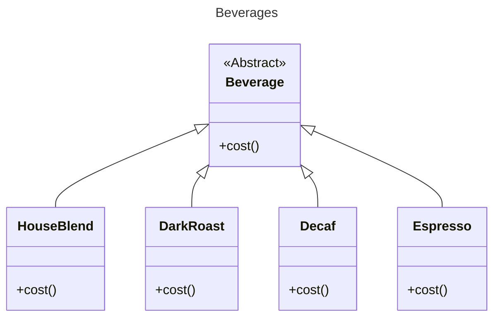
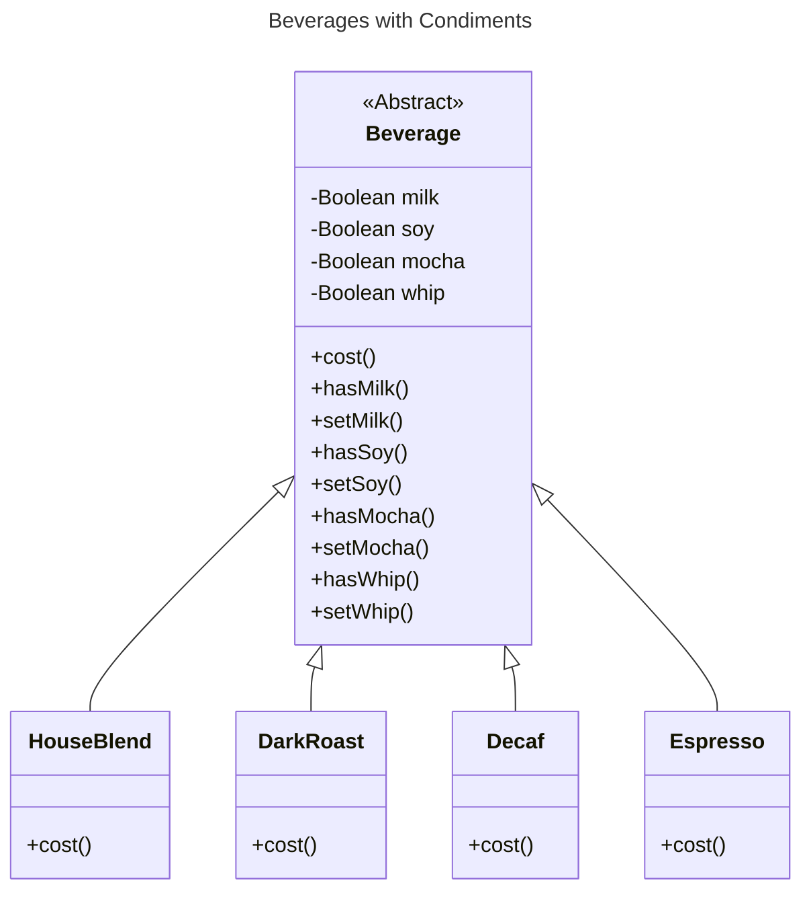
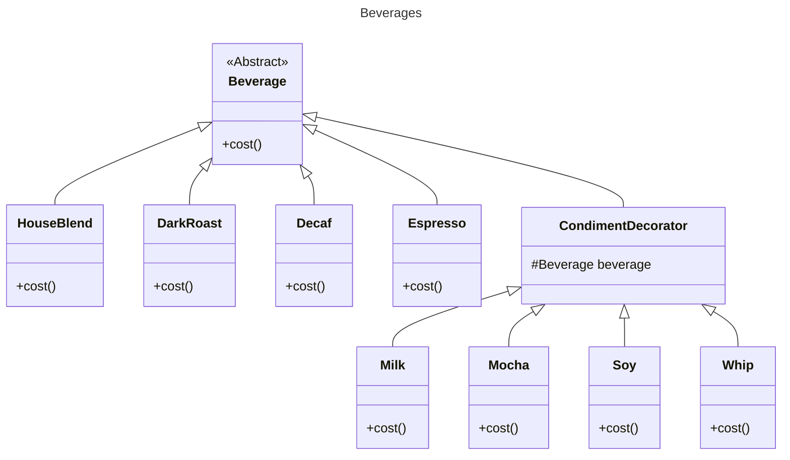

# Decorator Pattern

## Overview

The Decorator Pattern dynamically adds responsibilities to an object, offering an alternative to subclassing for extending behavior.

It uses decorator classes to wrap components (storing a reference to the wrapped object).

Decorators extend behaviors by:
- Delegating tasks to the object they decorate (forwards method calls to the object)
- Adding new functionality before and/or after method calls
- Completely overriding the object's behavior

Decorator classes mirror the type of the components they decorate, sharing the same supertype (or interface), allowing decorated objects to be used in place of the original.

Decorators can wrap other decorated objects and can be applied at runtime, enabling dynamic addition of new behaviors without altering existing code.


## Structure



The `ConcreteComponent` is the object to which we add new behavior dynamically. It extends `Component`.

`Decorator` implement the same interface or abstract class as the component they they decorate and wrap the component via an instance variable.

The `ConcreteDecorator` inherits the decorated object from `Decorator` as an instance variable.

Decorators extend `ConcreteComponent`'s behavior, typically adding behavior before or after calling existing methods.

Decorators are usually transparent to the client that use `Component`, unless the client relies on the component's concrete type.

A decorator doesn't know about other decorators in the chain. To view multiple layers in the decorator chain, we can implement a method in the `Component` interface to return a list of wrapped classes.


## Trade-offs

If we have code that relies on specific (concrete) types, decorators will break it (for example, code like: `if (object instanceof Bird) doSth()`). Check for this issue before applying decorators.

Decorators can create many small objects, leading to complexity and less straightforward design. This requires training or documentation for proper usage.

They also increase code complexity for instantiating components, as you need to instantiate the component and wrap it with multiple decorators.


## Example

### The initial design

We have a coffee shop with different beverages on its menu.

The `Beverage` is an abstract class, subclassed by all beverages offered in the coffee shop.

The `cost()` method return the cost of the beverage.



You can add condiments like steamed milk, soy, and mocha to your coffee, each with an additional cost.

We use instance variables and inheritance in the superclass to keep track of the condiments:
- Boolean values for each condiment.
- Implement `cost()` in `Beverage` to calculate the costs associated with the condiments for a particular beverage instance.
- Subclasses will extend `cost()` to include the specific beverage's cost, then add condiment costs by calling the superclass's `cost()`.




### Problems

Price changes for condiments will force us to alter existing code.

New condiments will require us to add new methods `has??()` and modify the `cost` method in the superclass. The code in the superclass should not be changed but extended in subclasses (open-closed principle).

We may have new beverages, for which some condiments might not be appropriate. For example, the `Tea` subclass will still inherit methods like `hasWhip()`.

Handling cases where a customer wants a "double mocha" is cumbersome because we use boolean values to track condiments.


### Solution



Coding beverages:
```ts
interface Beverage {
  cost(): number;
}

class Espresso implements Beverage {
  cost(): number {
    return 1.99;
  }
}
```

Coding decorators:
```ts
abstract class CondimentDecorator implements Beverage {
  beverage: Beverage;

  constructor(beverage: Beverage) {
    this.beverage = beverage;
  }
}

class Mocha extends CondimentDecorator {
  private beverage: Beverage;

  constructor(beverage: Beverage) {
    this.beverage = beverage;
  }

  getDescription(): string {
    return this.beverage.getDescription() + ", Mocha";
  }

  cost(): number {
    return this.beverage.cost() + 0.20;
  }
}
```

When the order is for a "double mocha soy latte with whip" beverage, we have the recipe:

```ts
let beverage2: Beverage = new HouseBlend()
beverage2 = new Soy(beverage2)
beverage2 = new Mocha(beverage2)
beverage2 = new Mocha(beverage2)
beverage2 = new Whip(beverage2)
```