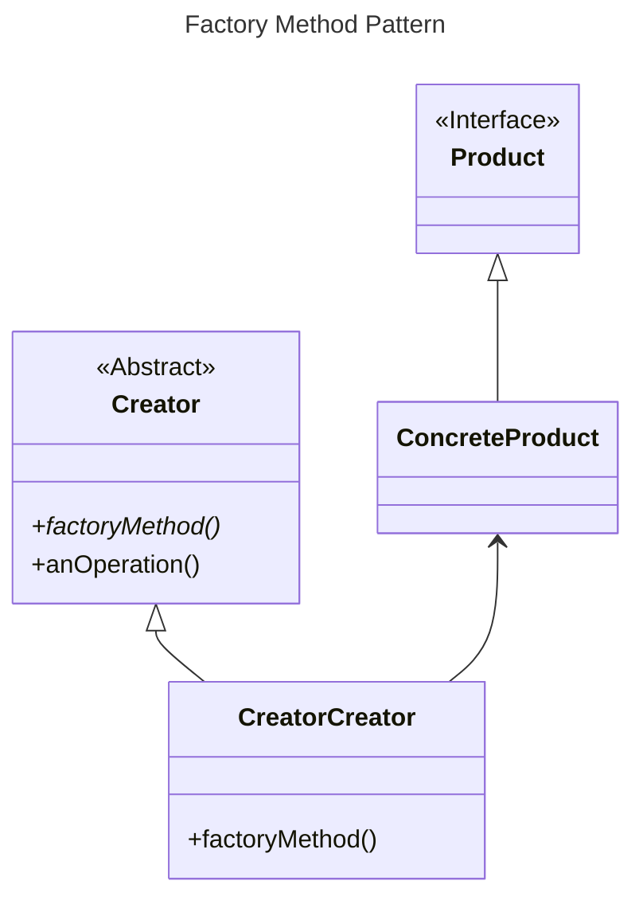
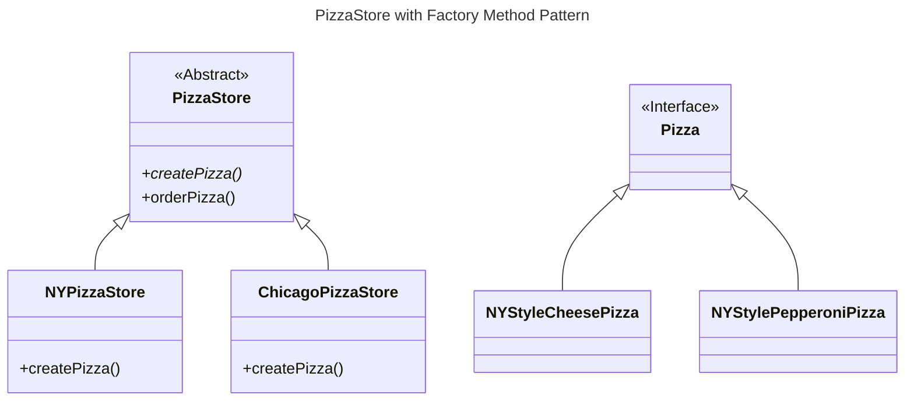

# Factory Method Pattern

## Overview

The Factory Method Pattern defines an interface for creating an object, but lets subclasses decide which class to instantiate.

Factory Method lets a class defer instantiation to subclasses.


## Structure




### Product interface

The `Product` interface defines behaviors supported by a product object.

All products implement the same interface, allowing code to refer to the interface instead of concrete classes.

Concrete products are created by concrete creators and utilized in the Creator.


### Creator class

The creator class defines an abstract factory method that the subclasses implement to produce products.

The creator never knows which concrete product was produced.

Any other methods implemented in the Creator are written to operate on products produced by the factory method. They can be common behaviors or utility functions related to the product.


### Factory method

A factory method is an interface for creating an object.

It is defined in the superclass as an abstract method:

It returns a `Product` that is typically used within methods defined in the superclass.

It may be parameterized (or not) to select among several variations of a product.

```ts
abstract factoryMethod(type: string): Product;
```


### Concrete Creator classes

Concrete creators are subclasses of the creator.

They implement the factory method and create products. This decouples the Creator from the object creation code.

For every concrete creator, there's typically a whole set of products that it creates. In other words, each set of products get its own creator class.

The client know about which set of products to choose. It instantiates the concrete creator and use its to perform the task.


## Example

We have a `PizzaStore` class with a `createPizza()` method that's responsible for making pizza.

There're different regions (`NY`, `Chicago`, `Chicago`). Each region serves different types of pizza (`cheese`, `veggie`, `clam`, `pepperoni`).

The `createPizza()` method receive the `region` and `type` parameters, use them to create the appropriate pizza, then cook it:
```ts
class PizzaStore {
  createPizza(region: string, type: string): Pizza | null {
    let pizza: Pizza | null = null;
    if (region === "NY") {
      if (type === "cheese") {
        pizza = new NYStyleCheesePizza();
      } else if (type === "veggie") {
        pizza = new NYStyleVeggiePizza();
      } else if (type === "clam") {
        pizza = new NYStyleClamPizza();
      } else if (type === "pepperoni") {
        pizza = new NYStylePepperoniPizza();
      }
    } else if (region === "Chicago") {
      if (type === "cheese") {
        pizza = new ChicagoStyleCheesePizza();
      } else if (type === "veggie") {
        pizza = new ChicagoStyleVeggiePizza();
      } else if (type === "clam") {
        pizza = new ChicagoStyleClamPizza();
      } else if (type === "pepperoni") {
        pizza = new ChicagoStylePepperoniPizza();
      }
    } else {
      console.log("Error: invalid region of pizza");
    }
    
    if (pizza) {
      pizza.prepare();
      pizza.bake();
      pizza.cut();
      pizza.box();
    }
    return pizza;
  }
}
```

### Problems

The `PizzaStore` class depends on a lot of concrete pizza classes (`NYStyleCheesePizza`, `NYStyleVeggiePizza`, ...).

Each time the implementation of those pizza classes changes (e.g., renaming, changing constructor), we have to modify the `PizzaStore`.

If you want to add California-region pizzas, you have to modify the `PizzaStore` and add more dependencies.

The Pizza Store already has a framework (procedure) for making pizzas in the `orderPizza()` method and you want to ensure that it's consistent across all regions but still give each regions freedom to create its own regional pizzas.


### Solution

What varies among the regional Pizza Stores is the style of pizzas they make.

We are going to push all these variations into the `createPizza()` abstract method. It's responsible for creating the right kind of pizza.

```ts
abstract class PizzaStore {
  orderPizza(type: string): Pizza {
    const pizza: Pizza = this.createPizza(type);

    pizza.prepare();
    pizza.bake();
    pizza.cut();
    pizza.box();

    return pizza;
  }

  abstract createPizza(type: string): Pizza;
}
```

We'll keep the pizza making logic in one class and have a subclass for each regional type (`NYPizzaStore`, `ChicagoPizzaStore`, `CaliforniaPizzaStore`).

Each subclass is going to have its own regional pizza by implementing the `createPizza()` method, while all subclasses still make use of the `orderPizza()` method:
```ts
class NYPizzaStore extends PizzaStore {
  createPizza(type: string): Pizza | null {
    let pizza: Pizza | null = null;
    if (type === "cheese") {
      pizza = new NYStyleCheesePizza();
    } else if (type === "pepperoni") {
      pizza = new NYStylePepperoniPizza();
    } else if (type === "clam") {
      pizza = new NYStyleClamPizza();
    } else if (type === "veggie") {
      pizza = new NYStyleVeggiePizza();
    }
    return pizza;
  }
}
```

If a franchise wants NY-style pizzas for its customers, it uses the `NYPizzaStore` subclass, which has its own `createPizza`() method for creating NY-style pizzas:
```tsx
PizzaStore nyPizzaStore = new NYPizzaStore();
nyPizzaStore.orderPizza("cheese");
```

When adding a new regional store, all we need to do is create a subclass of `PizzaStore` and supply a `createPizza()` method that implements their style of pizza.



## FAQ

### What's the advantage of the Factory Method Pattern when you only have one ConcreteCreator?

Even when you only have one ConcreteCreator, it's still useful because you are decoupling the creation (implementation) of the product from its use.

If you add additional products or change a product's implementation, it will not affect your Creator (because the Creator is not tightly coupled to any ConcreteProduct).


### Are the factory method always abstract?

No, you can define a default factory method to produce some concrete product.

Then you can always create products even if there are no subclasses of the Creator class.


### Do all concrete creators make multiple products, or do they sometimes just make one?

A parameterized factory method can make more than one type of object based on a parameter passed in:
```ts
function createProduct(type) {
  switch (type) {
    case "ProductA":
      return ...
  }
}
```

However, a factory method can just produces one object and is not parameterized.

Both are valid forms of the pattern.


### What if i pass a wrong `type` to a parameterized factory method?

That would cause a runtime error. 

There are several other more sophisticated techniques that can be used to make parameters more "type safe" (ensure errors in parameters can be caught at compile time) by using static constants, or enums.


### How's it different with Simple Factory?

The Concrete Creator do look a lot like Simple Factory.

Howerver, with Factory Method you are creating a framework that lets the subclasses decide which implementation (concrete product) will be used.

For example, the `orderPizza()` method in the Factory Method Pattern provides a general framework for creating pizzas that relies on a factory method to actually create the concrete classes that go into making a pizza.

By subclassing the `PizzaStore` class, you decide what concrete products go into making the pizza that `orderPizza()` returns. 

Compare that with Simple Factory, which gives you a way to encapsulate object creation, but doesn't give you the flexibility of Factory Method because there is no way to vary the products you're creating.