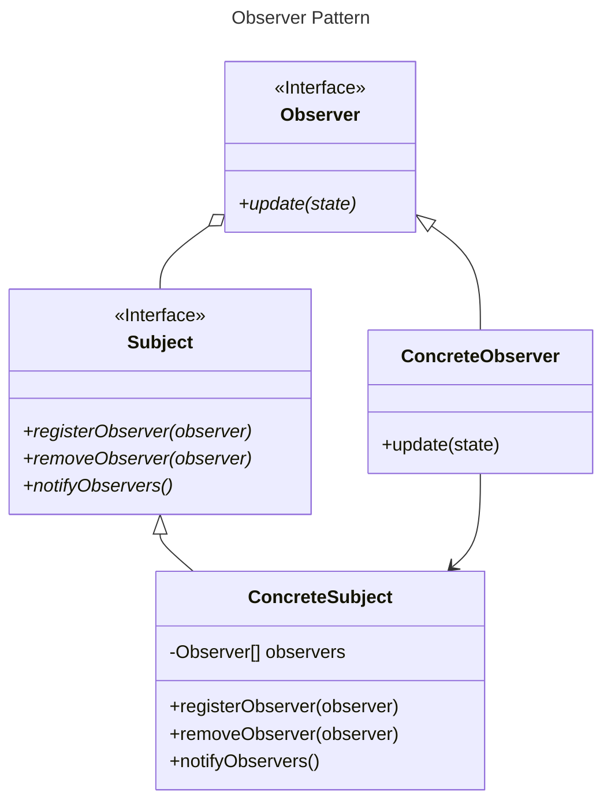
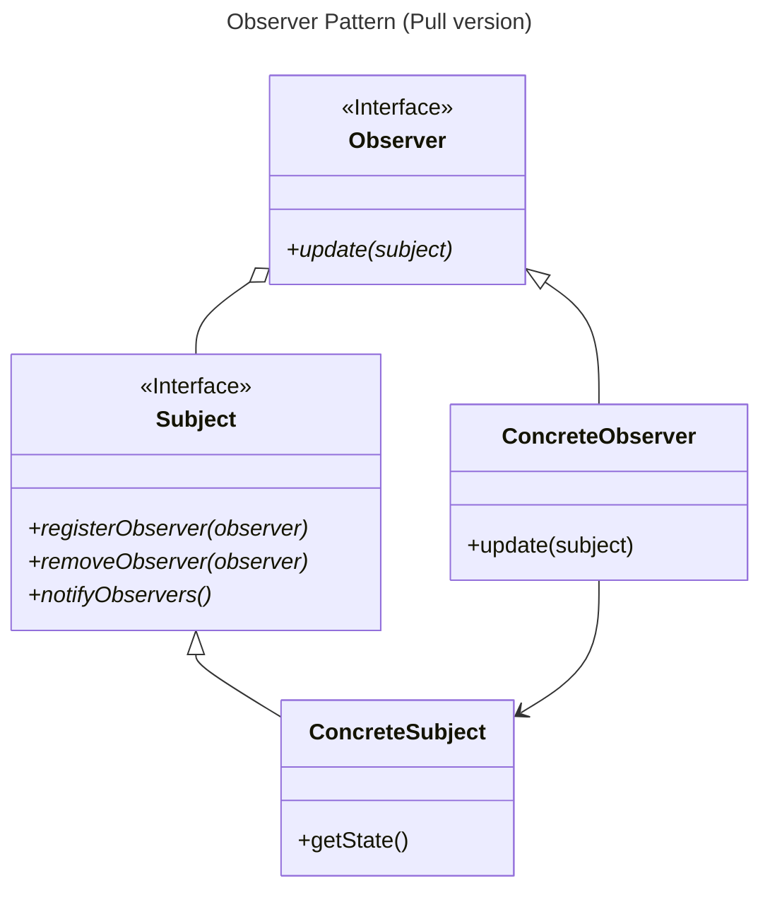

# Observer Pattern

## Overview

The Observer Pattern defines a one-to-many dependency between objects.

When one object changes state, all of its dependents are notified.

Observer is one of the most commonly used design patterns.

You'll find the pattern in many places, including RxJava, JavaBeans, and RMI, as well as in other language frameworks, like Cocoa, Swift, and JavaScript events.


## Structure



### Subjects

We have one subject, which hold the state and controls it. 

The subject notifies many observers when its state changes.

All concrete subjects implement `Subject` interface.

`Subject` interface: 
- Has methods for objects to register themselves as observers (`register`), and also to remove themselves from being observers (`remove`)
- Define a `notifyObservers()` method for concrete subject  update all the current observers whenever state changes.


### Observers

There are many observers that use the state, but don't own it. 

Observers rely on the subject to tell them when its state changes.

Subjects update observers using a common interface: `Observer` interface.

Observers of any concrete type can participate in the pattern as long as they implement the `Observer` interface.

The `Observer` interface has one method, `update()`, that is called by the subject (to notify observers) when its state changes.
```ts
class ConcreteSubject implements Subject {
  private observers: Observer[] = [];
  private state: string = '';

  public notifyObservers() {
    for (const observer of this.observers) {
      observer.update(this.state);
    }
  }
}
```

Each observer is registered with a concrete subject to receive updates.

Observers can be implemented as functions instead of class objects:
```ts
// Define observer as a function
const handleClick = (event: MouseEvent): void => {
    console.log('Window clicked!', event);
};

// Register observer function to the subject (window object)
window.addEventListener('click', handleClick);
```


## Pulling State from Subject

When a subject notifies state changes, all state is pushed to the `update()` method in observers, even if they don't need all the values.

Adding another state value later requires changing all `update()` methods in all observers, regardless of their need for the new data.

It's often better to let Observers retrieve the data they need instead of passing more data through `update()`.

All we need to do is make sure the Subject has getter methods for its data, allowing Observers to pull appropriate data as needed.

In this case, Observers need to check if its referenced subject has the getter methods they require:

```ts
class ConcreteSubject implements Subject {
  public notifyObservers() {
    for (const observer of this.observers) {
      observer.update(this);
    }
  }

  public getState(): string {
    return this.state
  }
}

class ConcreteObserver implements Observer {
  public update(subject: Subject) {
    if (subject instanceof ConcreteSubject) {
      const state = subject.getState()
    }
  }
}
```





## Loose Coupling

The Observer Pattern is a great example of **loose coupling**. the ways the pattern achieves loose coupling:
- The only thing the subject knows about an observer is that it implements a the `Observer` interface. It doesn't need to know the concrete class of the observer, what it does, or anything else about it.
- We can add, remove, or replace observers at any time.
- We never need to modify the subject to add new types of observers. All we have to do is implement the `Observer` interface in the new class and register as an observer.
- Changes to either the subject or an observer will not affect the other.


## Open-closed Principle

The Observer Pattern allows us to extend the Subject behavior at any time by adding new Observers without modifying the existing code.


## Relationship

The Observer Pattern is related to the Publish/Subscribe Pattern, which is for more complex situations with multiple Subjects and/or multiple message types.
