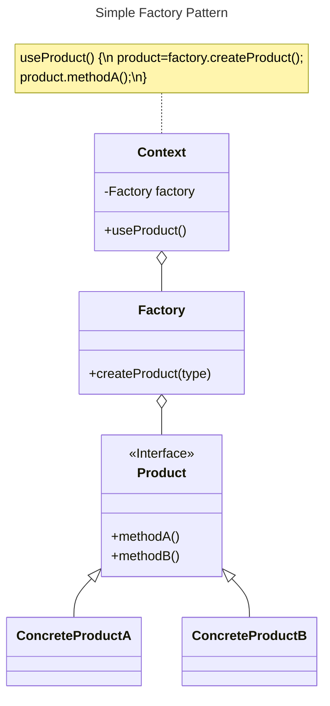

# Simple Factory Pattern

## Overview

The Simple Factory encapsulates object creation logic in a separate class (known as the factory).

While it isn't officially a Design Pattern, it is commonly used.


## Benefits

It helps decoupling client code from instantiating concrete classes:
- Code that instantiates concrete classes is an area of frequent change. It can mess up our code and prevent it from being **closed for modification**.
- Tying code to concrete classes means you're [programming to implementations](../design-principles/program-to-interfaces), make it more fragile and less flexible.

Placing all creation code in one object or method helps avoid duplication and provide one place to perform maintenance.

Clients now depend only upon interfaces rather than the concrete classes required to instantiate objects. This allows programming to an interface, not an implementation, which enhances code flexibility and extensibility.


## Use Cases

- When you want to encapsulate complex object creation logic.
- To decouple client code from concrete classes.
- When supporting multiple product variations or customization.


## Structure



`Context` is the client code that make use of `Product` objects. It goes through a `Factory` object to get instances of `Product`.

The `Product` interface defines methods used by clients. Each concrete product implements the `Product` interface.

The `Factory` class:
- Encapsulate complex object creation logic
- Contains a method `createProduct()`, which may be parameterized, that creates and returns instances of specific `Product`.
- Should be the only part of the application that references concrete classes


## Example

Suppose a pizza shop that has different types of pizza: `CheesePizza`, `GreekPizza`, `PepperoniPizza`, ...

The `PizzaStore` class has an `orderPizza()` method that handles pizza orders. It determines which type of pizza to serve, then cooks, and returns the pizza:

```tsx
class PizzaStore {
  orderPizza(type: string): Pizza {
    let pizza: Pizza;

    // This is what varies. As the pizza selection changes over time,
    // you'll have to modify this code over and over.
    if (type === "cheese") {
      pizza = new CheesePizza();
    } else if (type === "greek") {
      pizza = new GreekPizza();
    } else if (type === "pepperoni") {
      pizza = new PepperoniPizza();
    } else {
      throw new Error('unsupported pizza type')
    }

    pizza.prepare();
    pizza.bake();
    pizza.cut();
    pizza.box();
    return pizza;
  }
}
```

In the method, we have several concrete classes being instantiated, and the decision of which to instantiate is made at runtime.

### Problem

Frequently, the pizza object is used in several parts of the application, leading to duplicated instantiation code. This makes maintenance and updates more difficult and error-prone when the logic of pizza creation changes.

Also, the code makes use of concrete pizza classes may have to be changed as new concrete classes are added. This means your code won't be "**closed for modification**" as you'll need to reopen it to extend with new types.


### Solution

We move the part that creates objects out of our code, into another class, `SimplePizzaFactory`:

```ts
class SimplePizzaFactory {
  createPizza(type: string): Pizza {
    let pizza: Pizza;
    if (type === "cheese") {
      pizza = new CheesePizza();
    } else if (type === "pepperoni") {
      pizza = new PepperoniPizza();
    } else if (type === "clam") {
      pizza = new ClamPizza();
    } else if (type === "veggie") {
      pizza = new VeggiePizza();
    } else {
      throw new Error('unsupported pizza type')
    }
    return pizza;
  }
}
```

`SimplePizzaFactory` handle the details of object creation.

`PizzaStore` becomes a client of that factory. It just cares that it needs an object that implements the `Pizza` interface, then use that object to create a pizza:

```ts
class PizzaStore {
  private factory: SimplePizzaFactory;

  constructor(factory: SimplePizzaFactory) {
    this.factory = factory;
  }

  orderPizza(type: string): Pizza {
    const pizza: Pizza = this.factory.createPizza(type);

    pizza.prepare();
    pizza.bake();
    pizza.cut();
    pizza.box();

    return pizza;
  }
}
```

It looks like we're just pushing the problem off to the factory. But the factory may have many clients that handle the object in a different way than our `PizzaStore`.

By encapsulating the pizza creating in one class, we now have only one place to make modifications when the implementation changes.

By using `Pizza` interface, the `PizzaStore` will work with any new classes implementing that interface through polymorphism.

We're also just about to remove the concrete instantiations from our client code.


### How about defining a factory as a static method?

By using static method, you don't need to instantiate an `Factory` object to make use of the `createProduct()` method.

But it also has the disadvantage that you can't subclass and change the behavior of the create method.