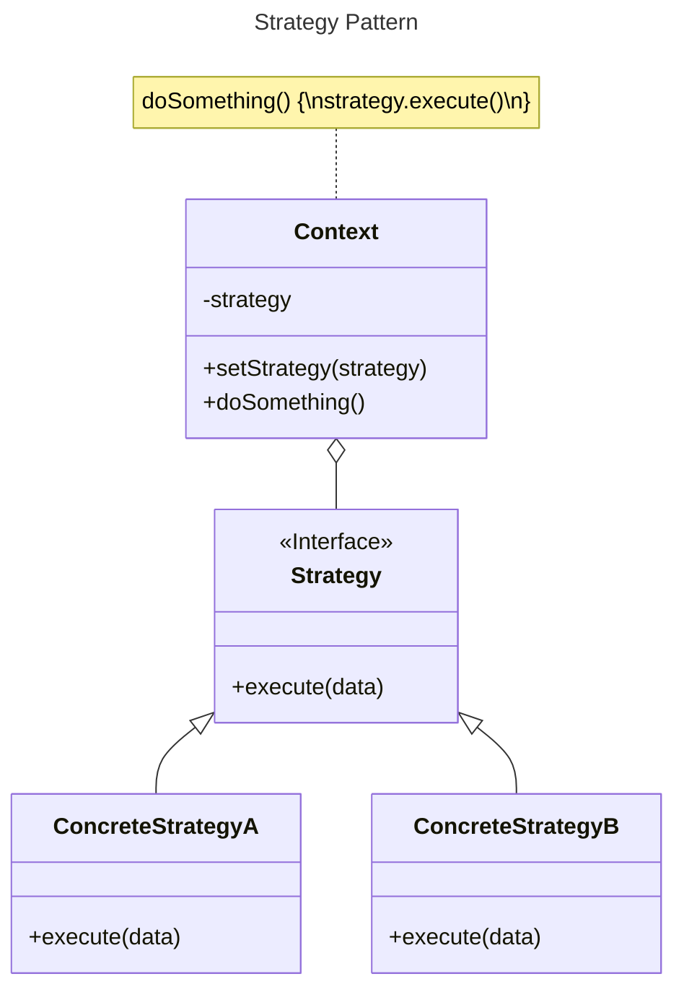
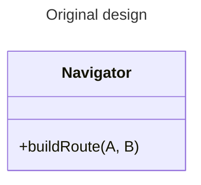
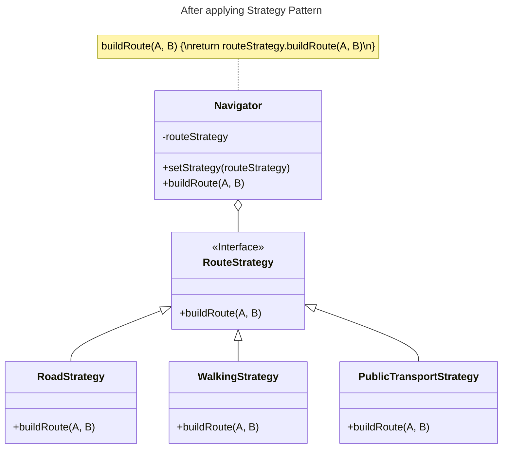

# Strategy Pattern

## Overview

Strategy pattern defines a family of algorithms, encapsulates each one, and makes them interchangeable.

The Strategy pattern suggests that you take a class that does something specific in a lot of different ways and extract all of these algorithms into separate classes called strategies.

Strategy lets the algorithm vary independently from clients that use it.

Strategy is a behavioral pattern.


## Benefits

- You can swap algorithms used inside an object at runtime.
- You can isolate the implementation details of an algorithm from the code that uses it.
- You can replace inheritance with composition.
- Open/Closed Principle. You can introduce new strategies without having to change the context.


## Structure



The **Strategy** interface is implemented by all concrete strategies. It declares a method to execute a strategy.

**Concrete Strategies** implement different variations of an algorithm.

The **Context** (class that executes the algorithm) maintains a reference to one of the concrete strategies and communicates with this object only via the strategy interface.

The context doesn't know about concrete strategies. It calls the execution method on the linked strategy object each time it needs to run the algorithm.

The **client** (code that creates the context) is responsible for selecting an appropriate algorithm and passing it to the context.

You can add new algorithms or modify existing ones without changing the code of the context or other strategies.

Client code:
```ts
// create the context object
const context = new Context();
if (conditionA) {
  context.setStrategy(new ConcreteStrategyA());
} else if (conditionB) {
  context.setStrategy(new ConcreteStrategyB());
}

// ...later in the application

// execute the strategy
context.doSomething();

// replace the strategy at runtime
context.setStrategy(new ConcreteStrategyC());
context.doSomething();
```


## Example

Consider a navigation application.

One of its features is routing, which allows users to enter an address and see the fastest route to a destination displayed on the map.

- From the beginning, it only built routes for people traveling by cars.
- Later you planned to add route building for cyclists.
- Then, in the next update, you added an option to build walking routes.
- Right after that, you added another option to let people use public transport in their routes.



```tsx
class Navigator {
  buildRoute(A: Point, B: Point, type: string) {
    switch (type) {
      case 'road':
        // create route for road
        break;
      
      case 'walking':
        // create route for walking
        break;
      
      // other routing algorithms...
    }
  }
}
```

### Problems

- Each time you added a new routing algorithm, the `Navigator` became bigger and harder to maintain.
- Implementing a new feature required you to change the same huge class, causing conflicts with the code produced by other people.
- Any change to one of the algorithms affected the whole class, increasing the chance of creating an error in already working code.


### Solution

In our navigation app, each routing algorithm can be extracted to its own routing class. Each routing class might build a different route.

The `buildRoute` method accepts an origin and destination and returns a collection of the route's checkpoints.

The navigator class doesn't care which algorithm is selected since its primary job is to render a set of checkpoints on the map.




## When to use?

- To dynamically switch between different variants of an algorithm within an object at runtime.
- When you have similar classes that differ only in behavior execution.
- To separate business logic from algorithm implementation details, making the code cleaner and more maintainable.
- When your class has a large conditional operator for switching between different algorithms.

**Example:** Isolating algorithms from a multi-step workflow.

The Strategy pattern allows you to extract all algorithms (which implement the same interface) into separate classes.


## How to apply?

1. Identify parts that are prone to frequent changes. It can be a massive conditional that selects and executes a variant of the same algorithm at runtime.
2. Find a common interface to all variants of the algorithm.
3. Extract all algorithms into their own classes. They should all implement the strategy interface.
4. In the context class, add a field for storing a reference to a strategy object. Provide a setter for replacing values of that field.
5. Clients of the context must associate it with a primary strategy

## Trade-offs

- Code is bloated with extra classes and interfaces:
  - If you only have a couple of algorithms and they rarely change (adding/removing), there's no real reason to overcomplicate the program
  - You can use functional type that lets you implement strategy classes as anonymous functions without defining extra classes.
- Clients must be aware of the differences between strategies to be able to select a proper one.
