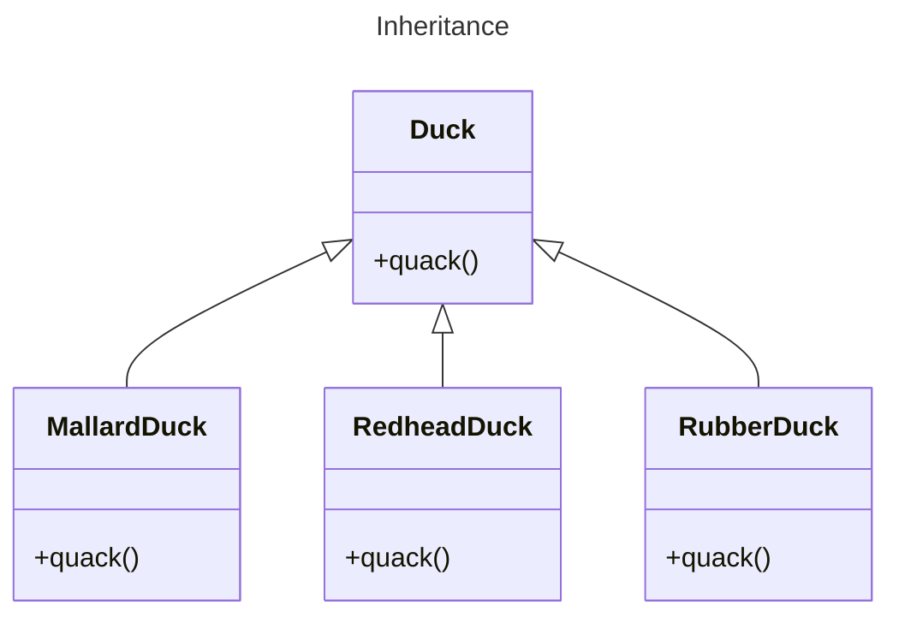
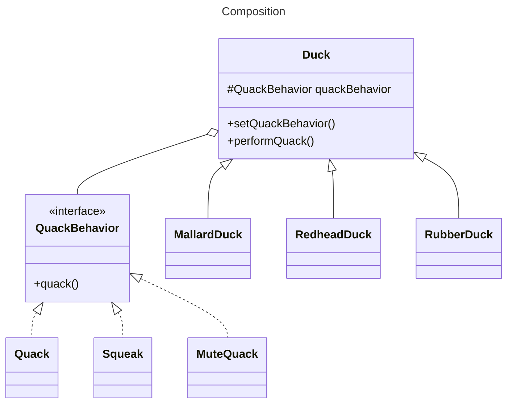
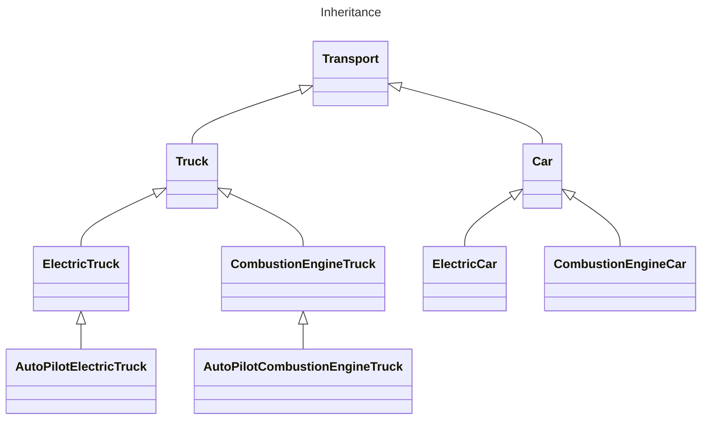
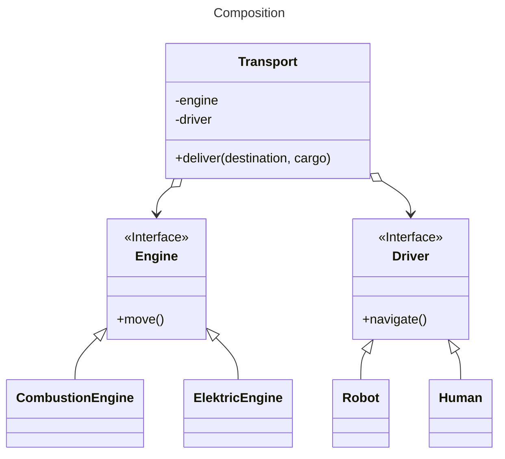

# Favor composition over inheritance

## The power of Composition

If we rely on inheritance, then our behavior can only be determined statically at compile time. In other words, we get only the behavior that the superclass provides or what we override.

It is possible to add new responsibilities to objects through **composition**, including those not designed in the superclass. This avoids modifying its code, reducing the risk of bugs or side effects in existing code.

Composition and delegation can often be used to add new behaviors at runtime.

Instead of inheriting a behavior from a superclass, each class composes the right behavior object.

Whereas inheritance represents the "is a" relationship between classes (a car *is* a transport), composition represents the "has a" relationship (a car *has* an engine).


## Benefits

Creating systems using composition gives you a lot more flexibility:
- Allows you to encapsulate a family of algorithms into their own set of classes
- Lets you extend an object's behavior at runtime.

Allows the implementation of the behavior to vary across classes while still enabling code reuse for classes with the same behavior.


## Example: Code Duplication

We have a base class called `Duck` with a method named `quack()`.

There are several subclasses of `Duck`, including `MallardDuck`, `RedheadDuck`, and `RubberDuck`.

Both `MallardDuck` and `RedheadDuck` share the same behavior for the `quack()` method, while `RubberDuck` behaves differently.

This similarity in behavior between `MallardDuck` and `RedheadDuck` results in code duplication across these subclasses.



To address the issue of code duplication, we can use composition instead of inheritance.

Each duck subclass can have its own `QuackBehavior` object, allowing them to delegate the `quack()` behavior to this composed object. The concrete behavior object (`Quack`, `Squeak`, `MuteQuack`) will be assigned to the composed object at runtime.

By doing so, we avoid repeating the same code across multiple subclasses and promote better code organization.



```ts
abstract class Duck {
  constructor(
    private quackBehavior: QuackBehavior
  ) {}

  setQuackBehavior(quackBehavior: QuackBehavior) {
    this.quackBehavior = quackBehavior;
  }

  performQuack() {
    this.quackBehavior.quack();
  }
}
```

```ts
const quack: QuackBehavior = new Quack();
const squeak: QuackBehavior = new Squeak();
const muteQuack: QuackBehavior = new MuteQuack();

const mallardDuck: Duck = new MallardDuck(squeak);
const redheadDuck: Duck = new RedheadDuck(squeak);
const rubberDuck: Duck = new RubberDuck(muteQuack);

// all ducks use the same API for quacking, although the way they quack can differ.
mallardDuck.performQuack();
redheadDuck.performQuack();
rubberDuck.performQuack();

// change the behavior of a duck at runtime
rubberDuck.setQuackBehavior(muteQuack);
rubberDuck.performQuack();
```


## Example: Class Explosion

Imagine that you need to create a catalog app for a car manufacturer.
- The company makes both cars and trucks; 
- They can be either electric or gas;
- All models have either manual controls or an autopilot.

With inheritance:
- extending a class in several dimensions (cargo type × engine type × navigation type) may lead to a combinatorial explosion of subclasses.
- each additional parameter results in multiplying the number of subclasses.
- there's a lot of duplicate code between subclasses because a subclass can't extend two classes at the same time.



You can solve this problem with composition. Instead of car objects implementing a behavior on their own, they can delegate it to other objects.



The added benefit is that you can replace a behavior at runtime, such as swapping an engine object in a car by assigning a different one.