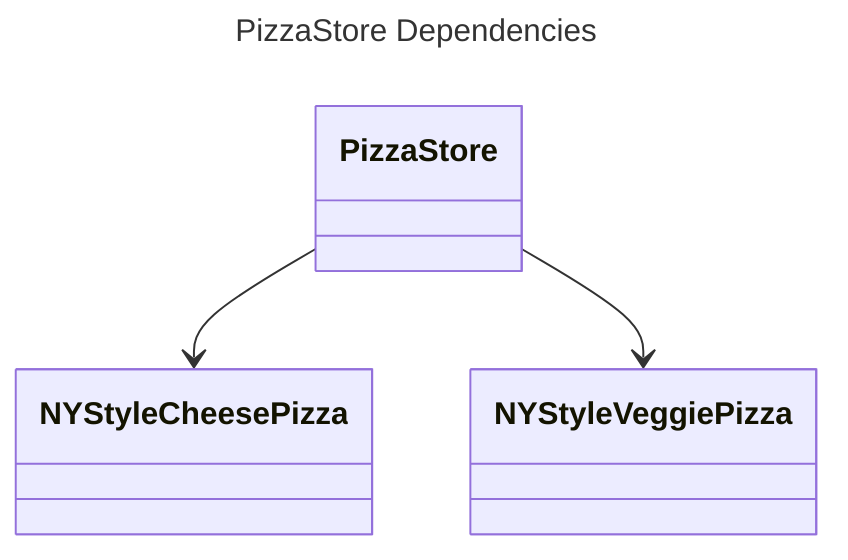
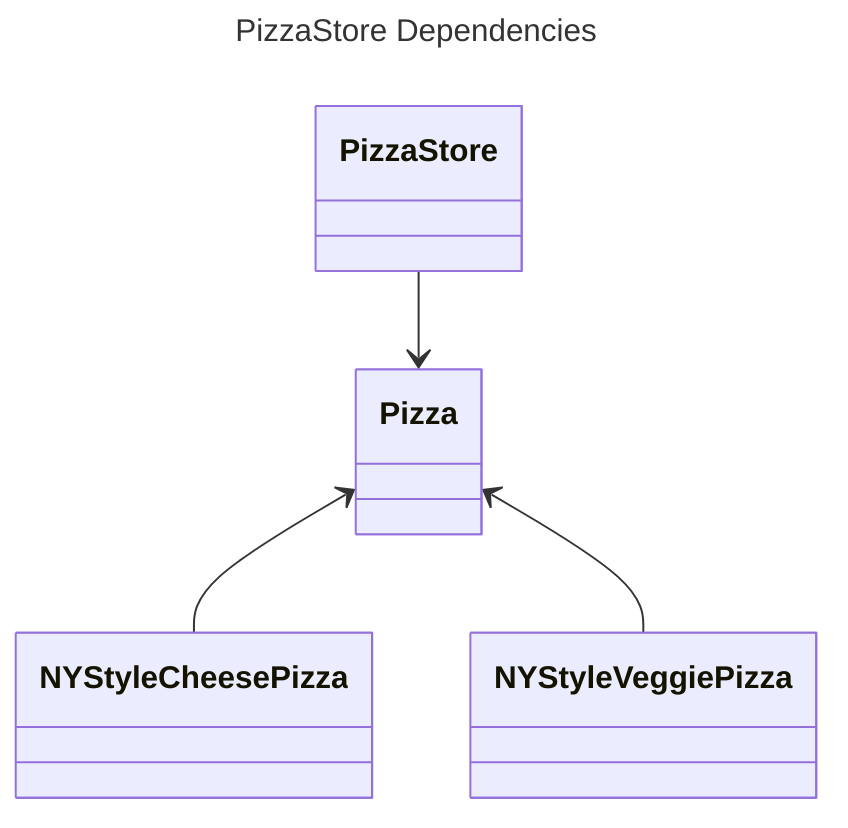

# Dependency Inversion Principle

## Overview

High-level classes should not depend on low-level classes, both should depend on abstractions.

Depend upon abstractions. Do not depend upon concrete classes.


## Low-Level Components

A low-level class deals with basic operations or specific technical details, such as:
- working with a disk
- transferring data over a network
- connecting to a database
- interacts with external API
- provide common functionality (e.g., string manipulation, date formatting)
- wrap external client library (e.g., AWS SDK, HTTP clients)
- ...

It's often reusable and focused on a single responsibility.


## High-Level Components

A high-level class contain complex business logic that directs low-level classes to do something.

Examples:
- **Service Layer**: Handles business logic, validation, and coordination.
- **Controller (in MVC)**: Manages user input, invokes services, and prepares data for views.
- **Use Case Classes**: Represent specific application use cases.


## Inverse Dependency

The term "inversion" refers to a shift in the traditional top-to-bottom dependency relationships between high-level and low-level classes. 

Sometimes people design low-level classes first and only then start working on high-level ones. With such an approach business logic classes tend to become dependent on primitive low-level classes.

The dependency inversion principle suggests changing the direction of this dependency:
1. For starters, you need to describe interfaces for low-level classes that high-level classes rely on, preferably in business terms.
2. Now you can make high-level classes dependent on those interfaces, instead of on concrete low-level classes. This dependency will be much softer than the original one.
3. Once low-level classes implement these interfaces, they inverted themselves by depending on a higher-level abstraction.

By doing so, we achieve loose coupling and greater flexibility in our codebase.


## Guidelines

The following guidelines can help you avoid OO designs that violate the Dependency Inversion Principle:
- **No variable should hold a reference to a concrete class**. If you use `new`, you'll be holding a reference to a concrete class. Use a factory to get around that.
- **No class should derive (inherit) from a concrete class**. If you derive from a concrete class, you're depending on a concrete class. Derive from an abstraction, like an interface or an abstract class.
- **No method should override an implemented method of any of its base classes**. If you override an implemented method, then your base class wasn't really an abstraction to start with. Those methods implemented in the base class are meant to be reused by  all your subclasses.

These guidelines are ideals to strive for, not strict rules.

Being aware of these guideline when you design help you know when you are violating the principle and you'll have a good reason for doing so.

If a class is unlikely to change, instantiating a concrete class isn't a major issue. If, on the other hand, a class you write is likely to change, you have some good techniques like Factory Method to encapsulate that change.

> In Java, we instantiate `String` objects frequently without concern. Does it violate principles? Yes. Is it okay? Yes, because `String` is very unlikely to change.


## Example

We have a `PizzaStore` class with a `createPizza()` method that's responsible for making pizza:
```ts
class PizzaStore {
  createPizza(region: string, type: string): Pizza | null {
    let pizza: Pizza | null = null;
    if (region === "NY") {
      if (type === "cheese") {
        pizza = new NYStyleCheesePizza();
      } else if (type === "veggie") {
        pizza = new NYStyleVeggiePizza();
      } else if (type === "clam") {
        pizza = new NYStyleClamPizza();
      } else if (type === "pepperoni") {
        pizza = new NYStylePepperoniPizza();
      }
    } else if (region === "Chicago") {
      if (type === "cheese") {
        pizza = new ChicagoStyleCheesePizza();
      } else if (type === "veggie") {
        pizza = new ChicagoStyleVeggiePizza();
      } else if (type === "clam") {
        pizza = new ChicagoStyleClamPizza();
      } else if (type === "pepperoni") {
        pizza = new ChicagoStylePepperoniPizza();
      }
    } else {
      console.log("Error: invalid region of pizza");
    }
    
    if (pizza) {
      pizza.prepare();
      pizza.bake();
      pizza.cut();
      pizza.box();
    }
    return pizza;
  }
}
```

If we draw a diagram representing the `PizzaStore` and all the objects it depends on:



The main problem with the `PizzaStore` is that it depends on every type of pizza because it actually instantiates concrete types in its `orderPizza()` method.

To get those instantiations out of the `orderPizza()` method, we apply the Factory Method Pattern. Then, our diagram looks like this:



After applying Factory Method, you'll notice that our high-level class, the `PizzaStore`, and our low-level classes, the pizzas, both depend on `Pizza`, the abstraction.
