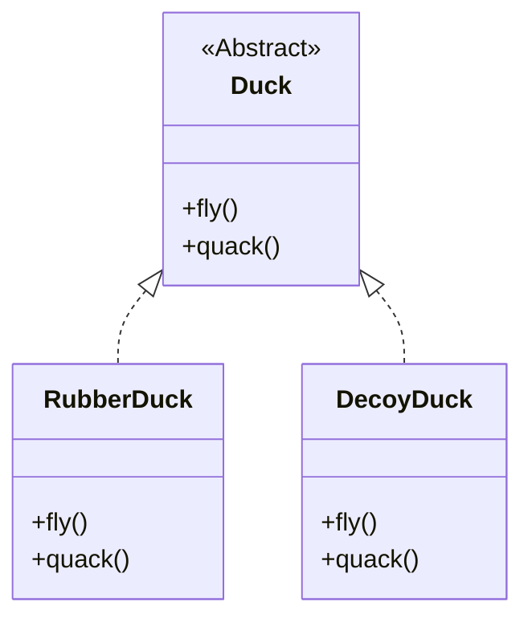
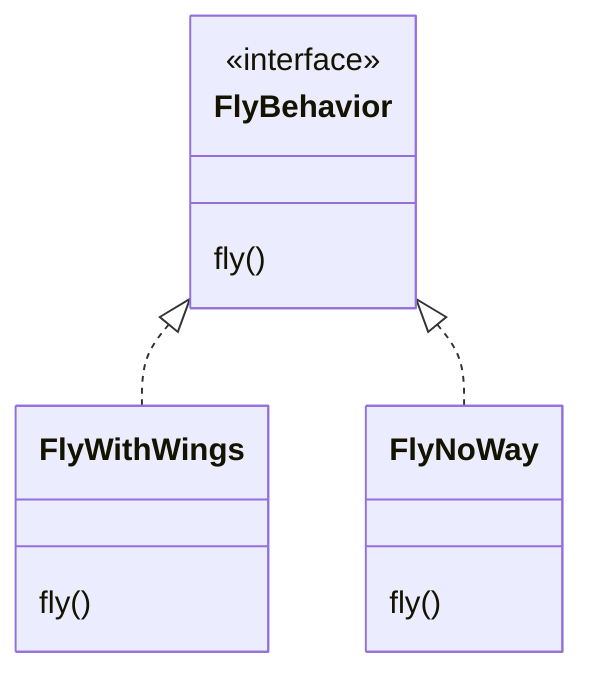
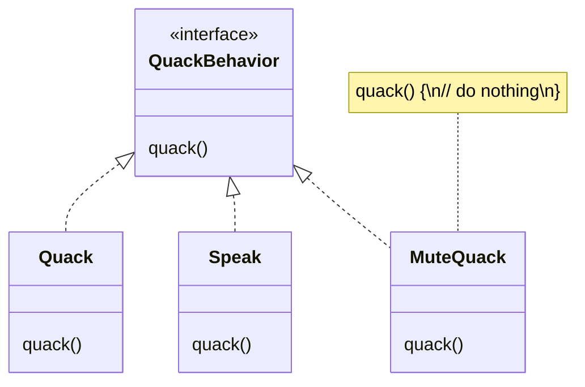
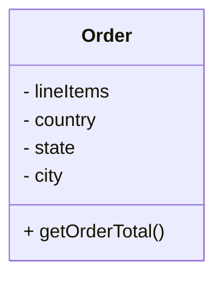
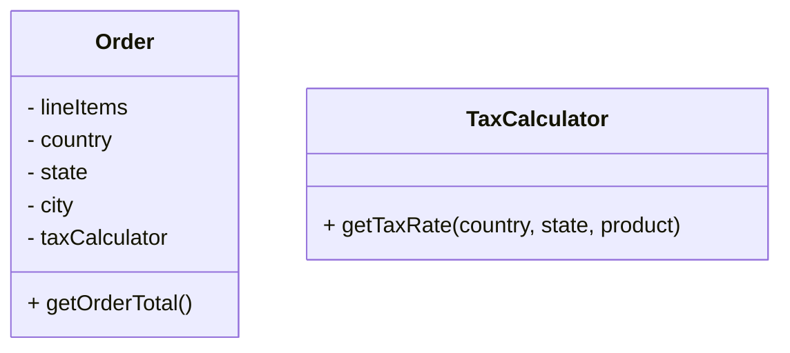

# Encapsulate changes

## Overview

***Identify the aspects of your application that vary and separate them from what stays the same.***

Separate parts that often change/vary, encapsulate them, so that later you can alter or extend them without affecting those that don't.


## Benefits

This principle helps minimizing the effect caused by changes, protecting the rest of the code from adverse effects. 

You spend less time getting the program back into working shape, implementing and testing the changes.

The less time you spend making changes, the more time you have for implementing features.


## Example: Encapsulate What Varies

We have an abstract class `Duck` and its subclasses `RubberDuck`, `DecoyDuck`.

The `fly()` and `quack()` methods vary across `Duck` subclasses:
- `RubberDuck` doesn't fly.
- `DecoyDuck` doesn't fly or quack.



To separate "parts that change", we extract the two methods to separated sets of classes. Each set of classes will hold all the implementations of the respective behavior (`fly` or `quack`).

We'll use interfaces to represent each behavior: `FlyBehavior` and `QuackBehavior`. Each implementation of a behavior will implement one of those interfaces.






## Example: Encapsulate What Likely to Change

Say you're making an e-commerce website. Somewhere in your code, there's a `getOrderTotal()` method that calculates a grand total for the order, including taxes.

We can anticipate that tax-related code might need to change in the future.

As a result, you'll need to change the `getOrderTotal` method quite often. But even the method's name suggests that it doesn't care about how the tax is calculated.



```
method getOrderTotal(order) is
  total = 0
  foreach item in order.lineItems
    total += item.price * item.quantity

  if (order.country == "US")
    total += total * 0.07 // US sales tax
  else if (order.country == "EU"):
    total += total * 0.20 // European VAT
  
  return total
```

To encapsulate tax calculation logic, we can:
1. Extract it to a separate method, hiding it from the original method
2. Move it to a separate class if the tax calculation logic becomes too complicated

With the second solution, our `Order` class become:


```
method getOrderTotal(order) is
  total = 0
  foreach item in lineltems
    subtotal = item.price * item.quantity
    total += subtotal * taxCalculator.getTaxRate(
      country, state, item.product)
  return total
```


## FAQ

### Do I always have to implement my application first?

Not always, when you are designing an application, you anticipate those areas that are going to vary and then go ahead to encapsulate them.