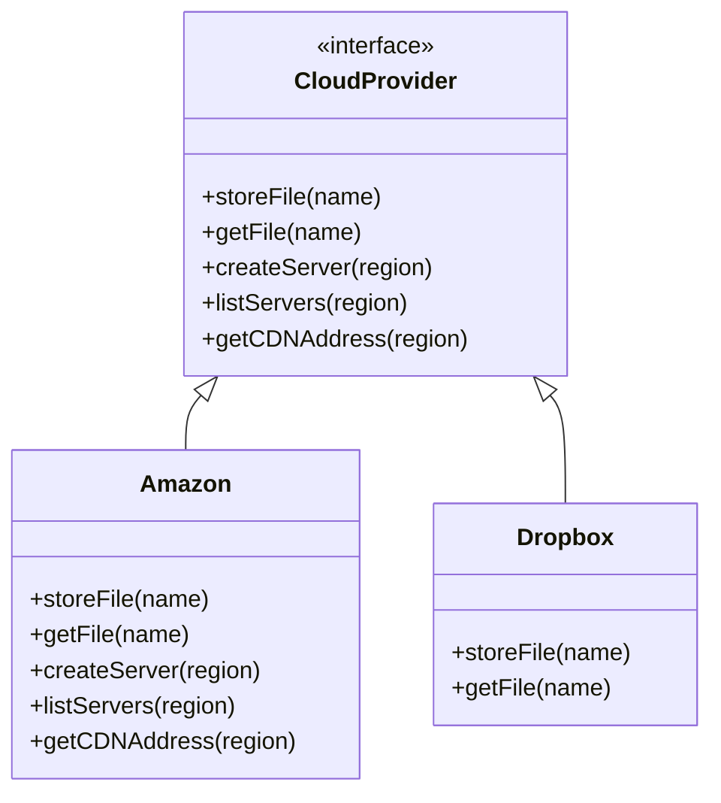
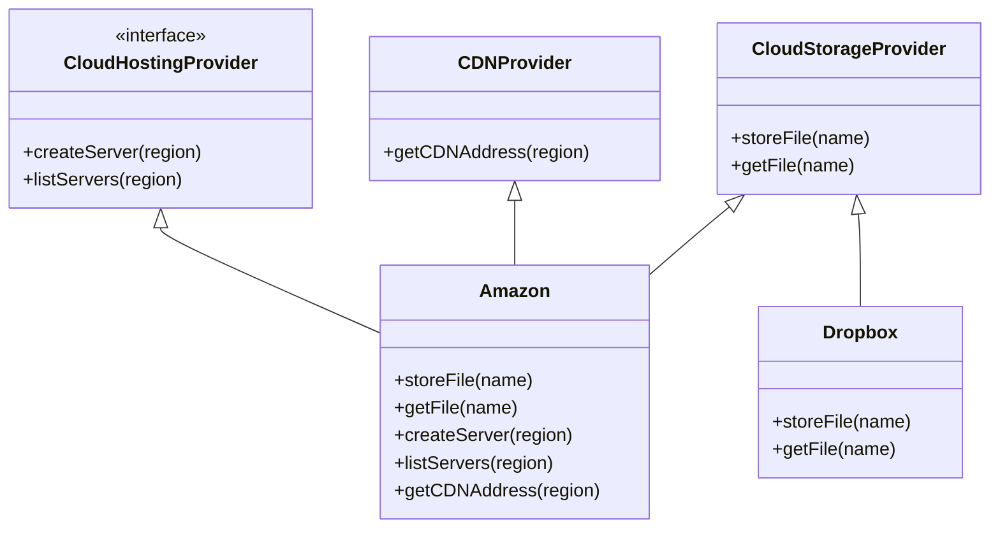

# Interface Segregation Principle

## Overview

No code should be forced to depend on methods it do not use.

In other words, interfaces should be small, role-specific, tailored to the needs of individual clients.

You should break down "fat" interfaces into several more refined ones. Clients should implement only those methods that they really need. Otherwise, a change to a "fat" interface would break clients that don't use the changed methods.

## Caveats

Don't further divide an interface which is already quite spe- cific. Remember that the more interfaces you create, the more complex your code becomes. Keep the balance.

## Example

Imagine that you created a library that makes it easy to integrate apps with various cloud computing providers.

At the beginning, you assumed that all cloud providers have the same broad spectrum of features.

But when it came to implementing support for another provider, it turned out that most of the interfaces of the library are too wide. Some methods describe features that other cloud providers just don’t have.

While you can still implement these methods and put some stubs there, it wouldn’t be a pretty solution.

The better approach is to break down the interface into parts. Classes that implement the original interface can now implement several refined interfaces. Other classes can implement only the interfaces with relevant methods.

