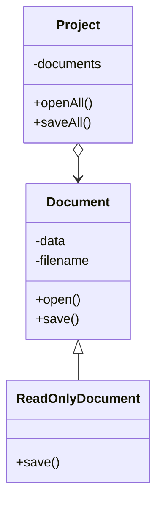
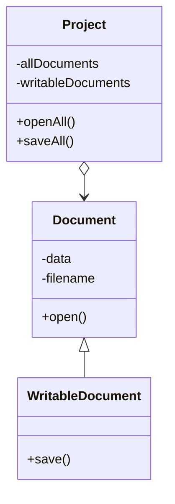

# Liskov Substitution Principle

## Overview

When extending a class, remember that you should be able to pass objects of the subclass in place of objects of the parent class without breaking the client code.

In other words, the subclass should remain compatible with the behavior of the superclass.

This concept is critical when developing libraries and frameworks because your classes are going to be used by other people whose code you can't directly access and change.

The substitution principle requires subclasses to meet certain criterias to ensure compatibility with code that works with superclass objects.


## Criterias

### Method Parameter Type

Parameter types in a method of a subclass should **match** or be **more abstract** than parameter types in the method of the superclass.

Example:
- A supperclass with method `feed(Cat c)`
- Good: a subclass override the method so that it can feed any animal `feed(Animal c)`. The method can feed all animals, so it can still feed any cat passed by the client.
- Bad: a subclass override the method to only accept Bengal cats `feed(BengalCat c)`. Since the method can only feed a specific breed of cats, it won't serve generic cats passed by the client, breaking all related functionality.


### Method Return Type

The return type in a method of a subclass should **match** or be a **subtype of** the return type in the method of the superclass.

Example:
- A supperclass with method `buyCat(): Cat`
- Good: a subclass override the method `buyCat(): BengalCat`. The client gets a Bengal cat, which is still a cat, so everything is okay.
- Bad: a subclass override the method `buyCat(): Animal`. Now the client code breaks since it receives an unknown generic animal that doesn't fit a structure designed for a cat.

### No New Exceptions

Methods in a subclass should not throw exceptions that are **not subtypes of** the exceptions thrown by the methods of the superclass.


### No strengthen pre-conditions

A subclass shouldn't strengthen pre-conditions.

For example, if a subclass overrides a base method that accepts an `int` parameter and requires it to be positive (throwing an exception for negative values), this strengthens the pre-conditions and can break client code that worked with negative numbers.


### No weaken pre-conditions

A subclass shouldn't weaken post-conditions.

Suppose a class method works with a database and is expected to close connections upon returning a value. You create a subclass that keeps connections open for reuse. However, clients may not know this change and could terminate the program, leading to ghost database connections.


### Preserve Superclass's Invariants

Invariants refer to properties or rules that remain true for all instances of the superclass and should also be preserved by any subclass.

For example, consider a superclass `Shape` with an invariant that the area of any shape must be non-negative. Regardless of whether an object is a circle, rectangle, or any other shape, this invariant (non-negative area) must always hold.

The rule on invariants is the easiest to violate because you might misunderstand or not realize all of the invariants of a complex class.

Therefore, the safest way to extend a class is to introduce new fields and methods, and not mess with any existing members of the superclass.


### No changing of private fields

A subclass shouldn't change values of private fields of the superclass (e.g., via reflection mechanisms).


## Example

Let's look at an example of a hierarchy of document classes that violates the substitution principle:



```ts
class Project {
  saveAll() {
    foreach (doc in documents) {
      if (!doc instanceof ReadOnlyDocument) {
        doc.save()
      }
    }
  }
}

class ReadOnlyDocument extends Document {
  save() {
    throw new Error("Can't save a read-only document.")
  }
}
```

- The `save` method in the `ReadOnlyDocuments` subclass throws an exception if someone tries to call it. The base method doesn't have this restriction. The client code will break if we don't check the document type before saving it.
- The `Project` class depends on the concrete class `ReadOnlyDocument`. If you introduce a new document subclass, you'll need to change the client code to support it.

You can solve the problem by redesigning the class hierarchy: a subclass should extend the behavior of a superclass, therefore the *read-only document* becomes the base class of the hierarchy. The *writable document* is now a subclass which extends the base class and adds the saving behavior.




```ts
class Project {
  saveAll() {
    foreach (doc in writableDocuments) {
      doc.save()
    }
  }
}
```
