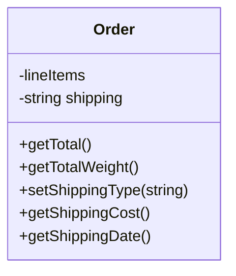
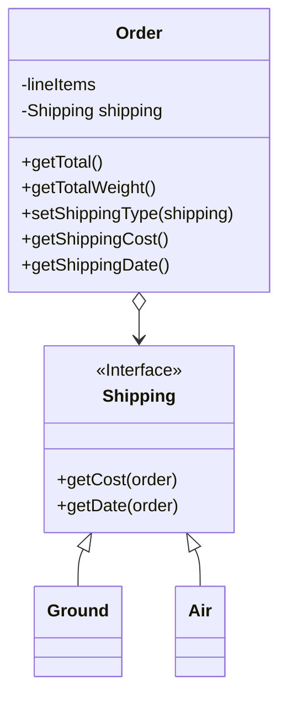

# Open/Closed Principle

## Overview

Classes should be open for extension, but closed for modification.

The main idea of this principle is to keep existing code from breaking when you implement new features.

**Open for extension**: a class is open if it can be extended with a subclass, not restricted (e.g., by keywords like `final` in Java).

**Closed for modification**: Once a class is developed, tested, reviewed, and in use, it should not be changed to avoid new bugs and additional testing. Instead of modifying the original class, create a subclass and override necessary parts to achieve your goals without affecting existing clients.

*If you know that there's a bug in the class, just go on and fix it; don't create a subclass for it. A child class shouldn't be responsible for the parent's issues.*


## Benefits

Following this principle ensures designs are resilient to change and flexible enough to adapt to new requirements.


## Example

You have an e-commerce application with an `Order` class that calculates shipping costs.

Also, all shipping methods are hardcoded inside the class.

If you need to add a new shipping method, you have to change the code of the Order class and risk breaking it.



```ts
class Order {
  getShippingCost(shipping: string) {
    if (shipping === "ground" {
      // Free ground delivery on big orders.
      if (this.getTotal() > 100) {
        return 0;
      }
      // $1.5 per kilogram, but $10 minimum.
      return max(10, this.getTotalWeight() * 1.5);
    }
    if (shipping === "air") {
      // $3 per kilogram, but $20 minimum.
      return max(20, this.getTotalWeight() * 3);
    }
  }
}
```

You can solve the problem by applying the Strategy pattern. Start by extracting shipping methods into separate classes with a common interface.



```ts
class Order {
  getShippingCost() {
    return this.shipping.getCost(this)
  }
}
```

Now, to add a new shipping method, you can derive a class from the `Shipping` interface without modifying the `Order` class.

The client code of the `Order` class will link orders with the new shipping class when users select this method in the UI.

As a bonus, this solution let you move the delivery time calculation to more relevant classes, according to the **single responsibility principle**.


## FAQs

**How to create design that is extensible yet closed for modification?**

Making OO design flexible and open to extension without modifying existing code takes time and effort.

By using design patterns, they give us time-tested designs that protect your code from being modified by supplying a means of extension.


**How can I make every part of my design follow the Open-Closed Principle?**

Usually, you can't. 

Following the Open-Closed Principle usually introduces new levels of abstraction, which adds complexity to our code.

Applying the Open-Closed Principle EVERYWHERE is wasteful and unnecessary, and can lead to complex, hard-to-understand code.


**Where to apply the Open-Closed principle?**

Focus on areas are most likely to change in your designs, and apply principles there.

To identify the areas of change that are most important, this involves both experience in designing object-oriented systems and understanding the specific domain you're working in.
