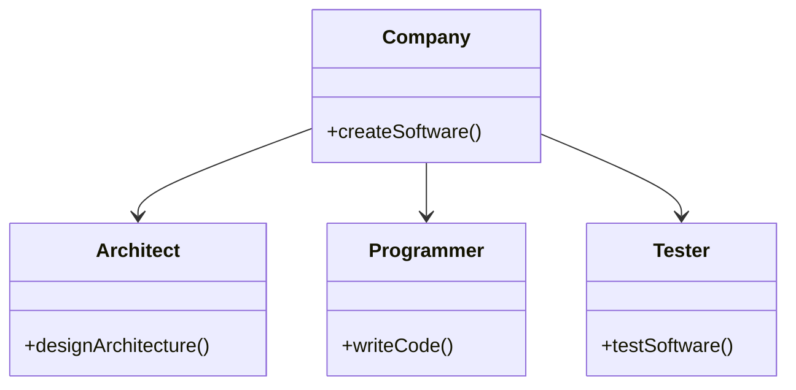
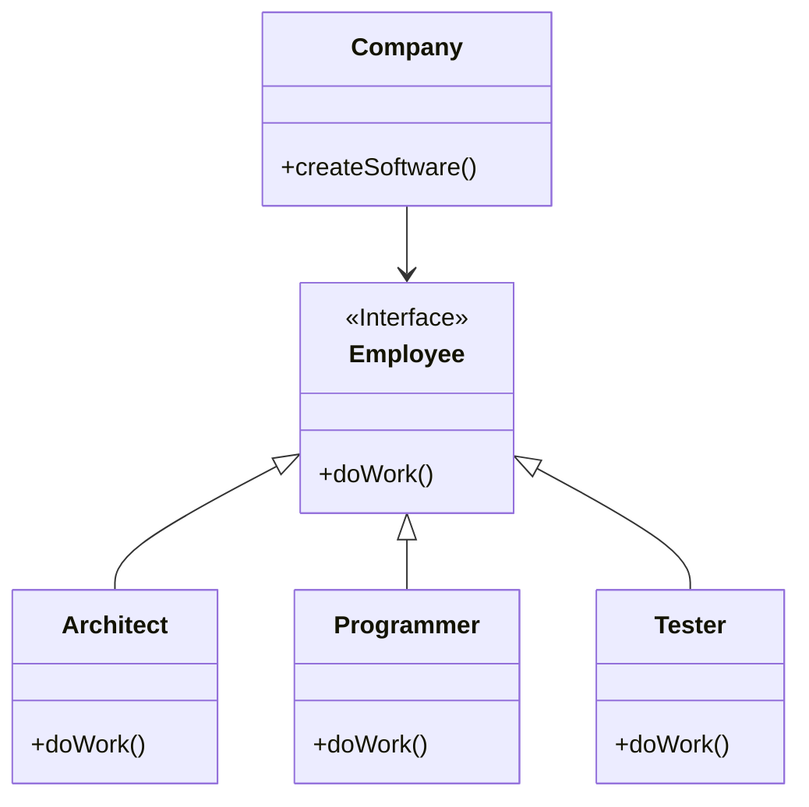

# Program to interfaces

## Overview

***Program to an interface, not an implementation***.

This design principle encourages writting code that rely on abstractions (interfaces or abstract classes) rather than implementations (concrete classes).

An example of programming to implementation is, when you use the `new` operator you are certainly instantiating a concrete class, so that's an implementation.

Let's say your code depends on a class:
- When that class changes, you need to review every change (methods and attributes) to see if you're referencing them in your code; then, possibly, a refactor is required.
- You're forced to use instances of that class or its subclasses in your code, which reduces flexibility


## Benefits

**Clearer Contracts**: Interfaces define clear contracts for what are expected, making the code more understandable and self-documenting.

**Maintainability**: Code that depends on interfaces is generally easier to maintain. Changes in one part of the system are less likely to affect other parts.

**Testability**: Interfaces make it easier to write unit tests. You can create mock implementations of the interface to test the function in isolation.

**Decoupling**: By depending on an interface, the function is decoupled from the specific implementation. This reduces dependencies and makes the code more modular.


## How to do?

When you want to set up collaboration between objects:
1. Determine what exactly one object needs from the other: which methods does it execute?
2. Describe these methods in a new interface or abstract class.
3. Make the class that is a dependency implement this interface.
4. Now make the second class dependent on this interface rather than on the concrete class.


## Use cases

Use interfaces when you want to achieve loose coupling between modules or systems. This happens when you want to devide your system in to isolated modules or your code relies on external libraries.


## Example

We have a `Company` class with different employee types:



```ts
class Company {
  createSoftware() {
    const d = new Designer();
    d.designArchitecture();

    const p = new Programmer();
    p.writeCode();

    const t = new Tester()
    t.testSoftware()
  }
}
```

The `Company` class is tightly coupled to concrete classes of employees. This is bad because if we introduce new types of employer or change one of the existing employer class, we need to modify the `Company` class.

To solve this problem, we can extract a common interface for all employee classes and let the `Company` class only depend on that interface:


```ts
class Company {
  constructor(private employees: Employee[]) {
  }
   
  createSoftware() {
    this.employees.forEach(employee => {
      employee.doWork()
    })
  }
}
```

After this change, the `Company` class has become independent from various employee classes. Now you can introduce new types of employees while still reusing the `Company` class.