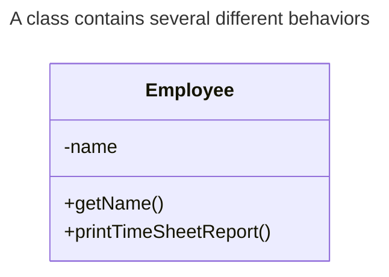
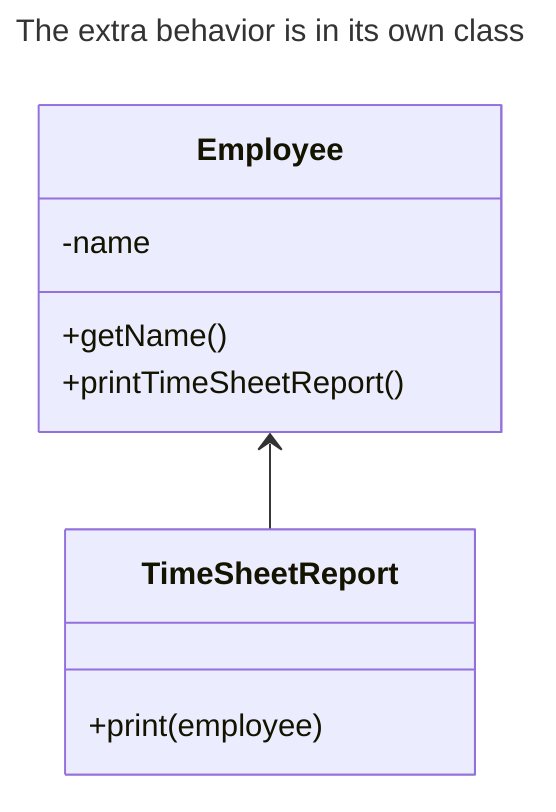

# Single Responsibility

## Overview

**A class should have just one reason to change.**

Try to make every class responsible for a single part of the functionality provided by the software, and make that responsibility entirely encapsulated by the class.

The main goal of this principle is reducing complexity.

## When to apply?

If you have a class does too many things, you have to change it every time one of these things changes. While doing that, you're risking breaking other parts of the class which you didn't even intend to change.

When classes become so big that you can no longer remember their details. You have to scan through entire classes or programs to find specific things.

If you feel that it's becoming hard to focus on specific aspects of the program one at a time, remember the single responsibility principle and check whether it's time to divide some classes into parts.

## Example

We have an `Employee` class that does two things:
- managing employee data
- print a timesheet report

The timesheet report may change over time, requiring you to change the code within the class.

Solve the problem by moving the behavior related to printing timesheet reports into a separate class.

