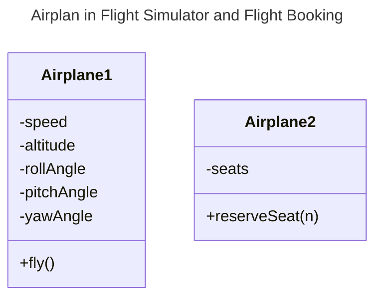

# Abstraction

## Overview

Abstraction is a model of a real-world object or phenomenon, limited to a specific context, which represents all details relevant to this context with high accuracy and omits all the rest.

## Explanation

Most of the time when you’re creating a program with OOP, you shape objects of the program based on real-world objects. However, objects of the program don’t represent the originals with 100% accuracy. Instead, your objects only model attributes and behaviors of real objects in a specific context, ignoring the rest.

## Example

For example, an `Airplane` class could probably exist in both a **flight simulator** and a **flight booking application**. But in the former case, it would hold details related to the actual flight, whereas in the latter class you would care only about the seat map and which seats are available.

