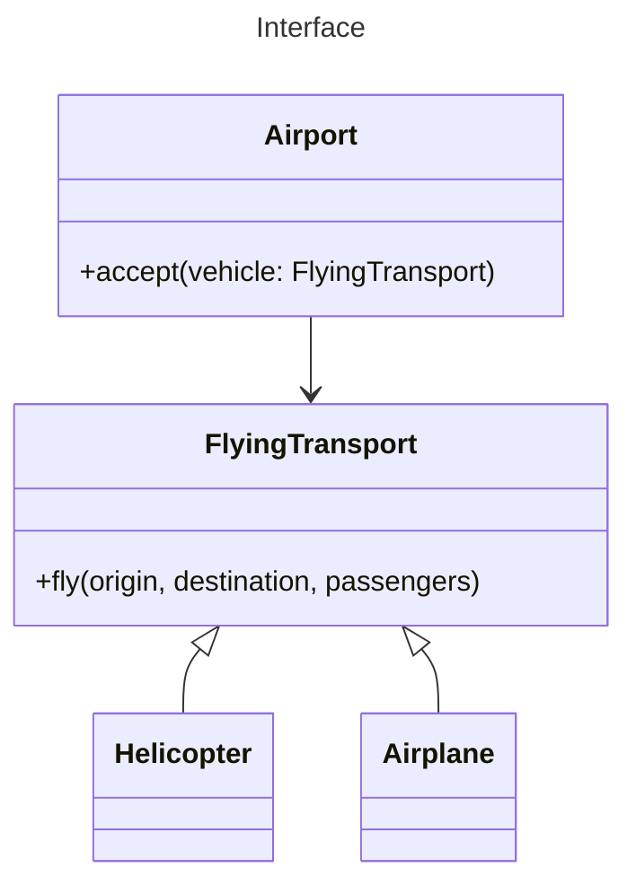

# Encapsulation

## Overview

Encapsulation is the ability of an object to hide parts of its state and behaviors from other objects, exposing only a limited interface to the rest of the program.

To encapsulate something means to make it ***private*** and only accessible from within the public methods of its own class.

For example, to start a car engine, you only need to turn a key or press a button. The complex processes under the hood are hidden, leaving you with a simple interface: a start switch, a steering wheel, and pedals. This illustrates how each object has an **interface** — a public part of an object, open to interactions with other objects.

## Interfaces

Interfaces and abstract classes/methods are based on the concepts of abstraction and encapsulation.

Interfaces let you define contracts of interaction between objects.

That's why interfaces only care about behaviors of objects, and you can't declare a field in an interface.

### Example

Imagine when designing an air transportation simulator, you have an `Airport` class that only work with flyable transportation, you could define an interface `FlyingTransport` and restrict `Airport` class methods to accept only objects implementing that interface.

After this, you can be sure that any object passed to an airport object, whether it's an `Airplane`, a `Helicopter` would be able to arrive or depart from this type of airport.

You could change the implementation of the `fly` method in these classes in any way you want. As long as the signature of the method remains the same as declared in the interface, all instances of the `Airport` class can work with your flying objects just fine.