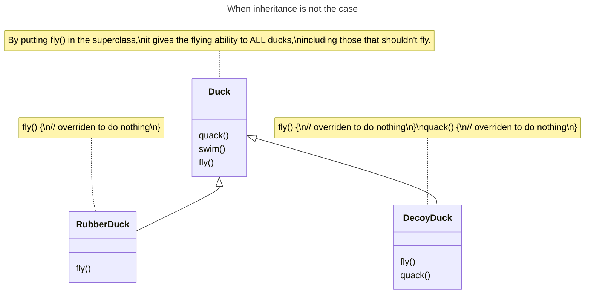

# Inheritance

## Overview

Inheritance is the ability to build new classes on top of existing ones.

## Benefits

**Code reuse**: inheritance is a straightforward way to reuse code between classes. If two classes have the same code, create a common base class and move the similar code there.

**Modularity**: a hierarchy of classes makes it easier to manage and understand the code, as related functionalities are grouped together.

**Extensibility**: easier to extend existing code. You can add new features or modify existing ones in the child class without altering the parent class

**Maintainability**: any changes or bug fixes of common functionalities in the parent class need to be made only once, reducing the risk of errors and making the code easier to maintain.

**Polymorphism**: allowing you to use a child class object wherever a parent class object is expected

## Limitations

**A subclass can't reduce the interface of the superclass**. You can't hide a method in a subclass if it was declared in the superclass. You have to implement all abstract methods of the parent class even if they don't make sense for your subclass.

**Behavior in subclass must be compatible with the base one**. It's important because objects of the subclass may be passed to any code that expects objects of the superclass and you don't want that code to break.

**Subclasses are tightly coupled to superclasses**. Changes in the superclasses class can have unintended effects on the subclasses, making the code harder to maintain.

**Trying to reuse code through inheritance can lead to creating parallel inheritance hierarchies**. Inheritance usually takes place in a single dimension. But whenever there are two or more dimensions, you have to create lots of class combinations, bloating the class hierarchy to a ridiculous size.

**Complex Hierarchies**. As the hierarchy grows, it becomes harder to trace the flow of the program and understand the relationships between classes.

## When not to use?

Inheritance should not be used when:
- Code reuse is not achievable. Behaviors keeps changing across subclasses
- There're some behaviors to the base class that aren't appropriate for some of the subclasses.

When a behavior is inapproriate for subclasses, it can be overriden (to do *nothing*, for example), but it leads to:
- Hard to gain knowledge of subclass behaviors: *which class support the behavior or not?*
- We'll be forced to look at every new subclass and possibly override new behavior

For example, with the `Duck` superclass:
- `RubberDuck` doesn't support `fly()`
- `DecoyDuck` doesn't support `fly()` or `quack()`

