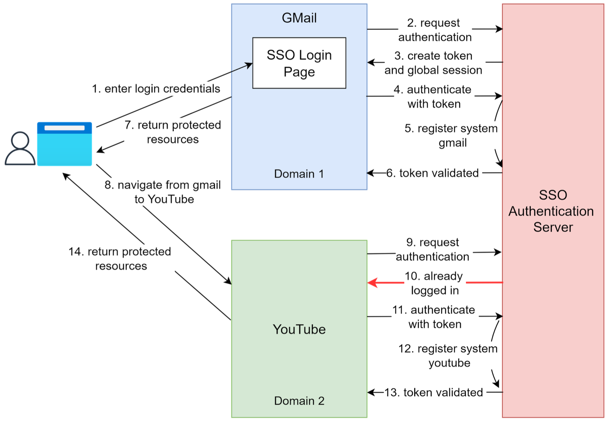

# Single Sign-On

## Overview

Single Sign-On (SSO) is an authentication scheme. It allows a user to log in to different systems using a single ID.

## Example Workflow

**Step 1**: A user visits Gmail, or any email service. Gmail finds the user is not logged in and so redirects them to the SSO authentication server, which also finds the user is not logged in. As a result, the user is redirected to the SSO login page, where they enter their login credentials.

**Steps 2-3**: The SSO authentication server validates the credentials, creates the global session for the user, and creates a token.

**Steps 4-7**: Gmail validates the token in the SSO authentication server. The authentication server registers the Gmail system, and returns "valid". Gmail returns the protected resource to the user.

**Step 8**: From Gmail, the user navigates to another Google-owned website, for example, YouTube.

**Steps 9-10**: YouTube finds the user is not logged in, and then requests authentication. The SSO authentication server finds the user is already logged in and returns the token.

**Step 11-14**: YouTube validates the token in the SSO authentication server. The authentication server registers the YouTube system, and returns "valid". YouTube returns the protected resource to the user.

The process is complete and the user gets back access to their account.

