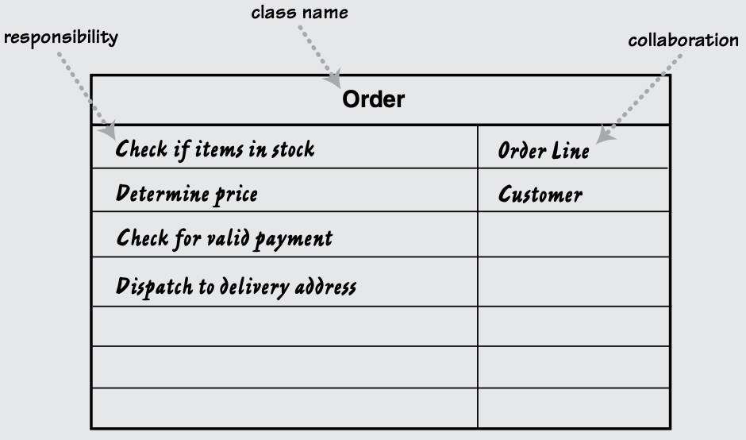

# CRC Cards

## Overview

CRC (Class-Responsibility-Collaboration) diagrams is a valuable technique that helps to explore object interactions.

Invented by Ward Cunningham in the late 1980s.

It involves creating **CRC cards**, which are index cards divided into three sections:

1. **Class**: Represents a collection of similar objects (e.g., students, professors, seminars).
2. **Responsibility**: Describes what a class knows or does (e.g., student names, enrollment in seminars).
3. **Collaborator**: Identifies other classes that a class interacts with to fulfill its responsibilities (e.g., students collaborating with the `Seminar` class to sign up for seminars).

## Use cases

**Conceptual Modeling**: CRC cards help developers brainstorm and capture the essential components of a system. By creating cards for each class, they can identify responsibilities and collaborations.

**Collaboration and Discussion**: Teams use CRC cards during design meetings. Each team member takes a card representing a class and discusses its responsibilities and interactions with other classes. This collaborative process ensures a shared understanding of the system.

**Transition to Class Diagrams**: CRC cards serve as a bridge between use-case descriptions and class diagrams. As discussions progress, the information on the cards can be used to create class diagrams, which provide a visual representation of the system's structure.

**Low Binding, High Cohesion**: By focusing on responsibilities and collaborations, CRC cards promote low coupling (binding) between classes and high cohesion within each class. This leads to more maintainable and modular code.
