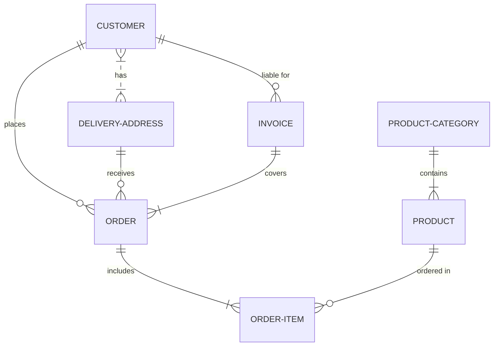

# Mermaid

## About

Mermaid lets you create diagrams and visualizations using text and code.

It uses Markdown-inspired text definitions and a renderer to create and modify complex diagrams.


## Supported diagram types
- Flowchart
- Sequence diagram
- Class diagram
- Git graph
- Entity Relationship Diagram
- State Diagram
- Gantt diagram
- User Journey Diagram
- Block Diagrams
- Quadrant Chart
- XY Chart
- Pie chart
- Mindmap
- Timeline


## Syntax Structure
All Diagrams definitions begin with a declaration of the diagram type, followed by the definitions of the diagram and its contents.

````mdx filename="Markdown"

````


## Integrations

- Nextra: it allows you to embed diagrams (using the `mermaid` code block) within documentation.
- Atlassian products:
  - Mermaid for Confluence
  - Mermaid Charts & Diagrams for Jira
  - ...
- VS Code:
  - [Mermaid Markdown Syntax Highlighting](https://marketplace.visualstudio.com/items?itemName=bpruitt-goddard.mermaid-markdown-syntax-highlighting)
  - [Markdown Preview Mermaid Support](https://marketplace.visualstudio.com/items?itemName=bierner.markdown-mermaid)


## Tools
- [Mermaid Live Editor](https://mermaid.live/)