# Block Diagrams

## Use Cases

- **Software Architecture**: showing how different modules or services interact, data flow, and high-level component interaction.
- **Network Diagrams**: depict how different network devices and services are interconnected, including routers, switches, firewalls, and the flow of data across the network.
- **Process Flowcharts**: Represent various stages of a business or manufacturing process, helping to visualize the sequence of steps, decision points, and the flow of control.
- **Electrical Systems**: Illustrate the high-level structure of an electrical system, the interaction between different electrical components, and the flow of electrical currents.
- **Educational Purposes**: explain complex concepts and systems in a simplified manner. breaking down and visualizing scientific theories, engineering principles, and technological systems.

## Block

Create a simple block diagram with three blocks:

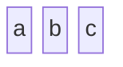

## Columns

Defining the number of columns to use

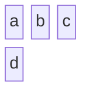

## Block label
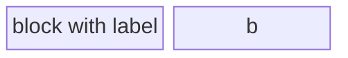
Setting block width:
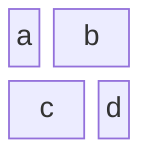

## Nested blocks
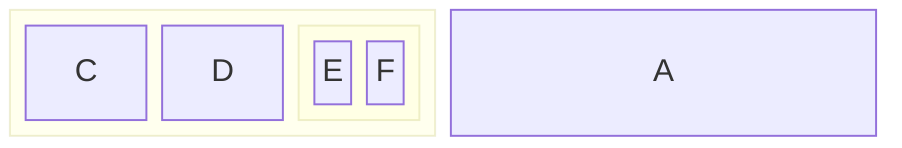

## Block Shape

Round Edged Block:
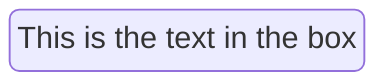

Stadium-Shaped Block:
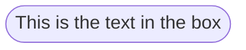

Cylindrical Shape:
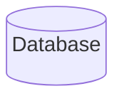

Circle Shape:
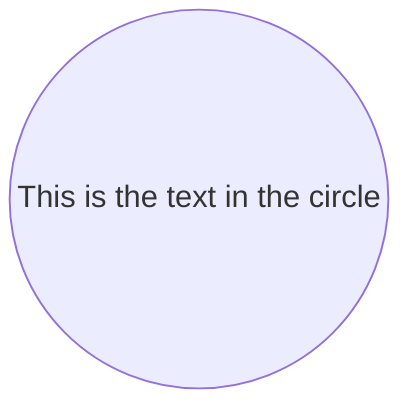

Rhombus:
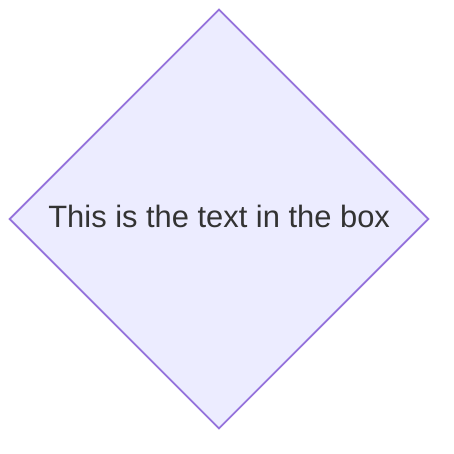

More shapes can be found [here](https://mermaid.js.org/syntax/block.html#_4-block-varieties-and-shapes).

## Connecting Blocks

Basic Links:
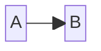

Text on Links:
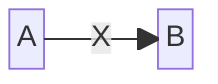