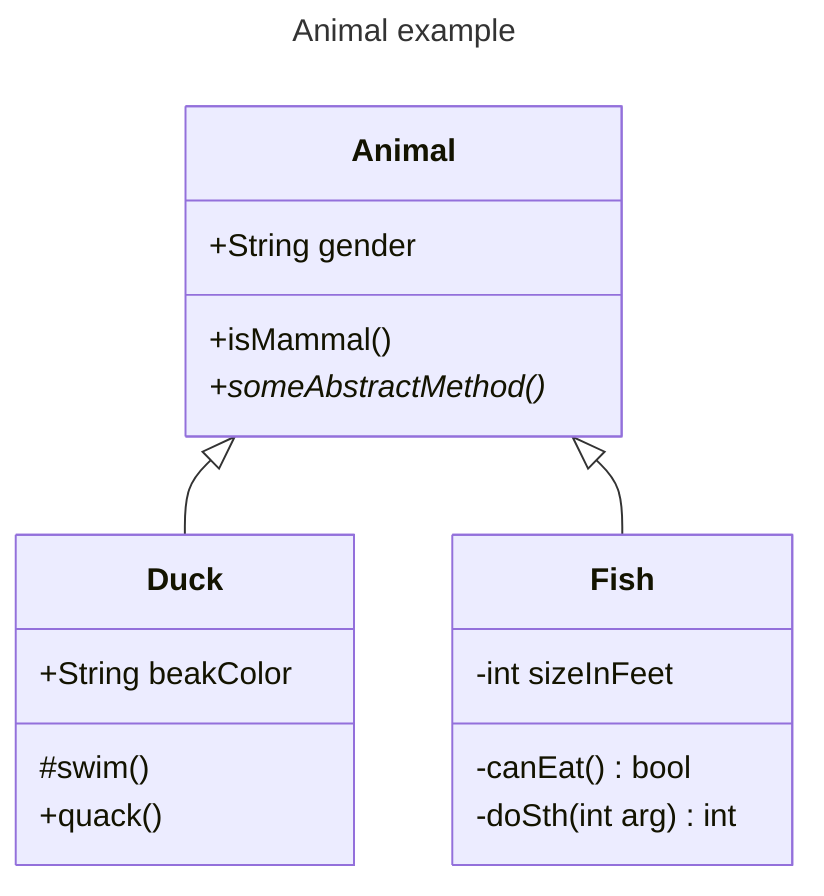
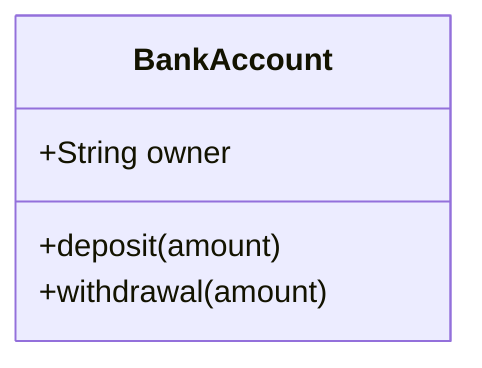
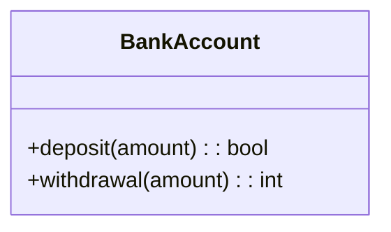
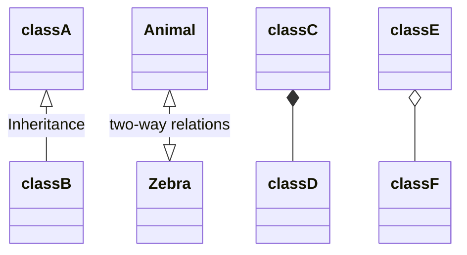
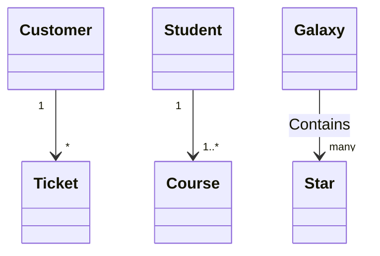
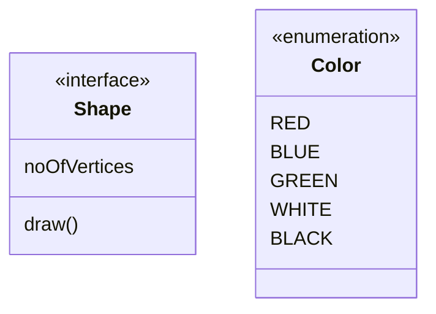
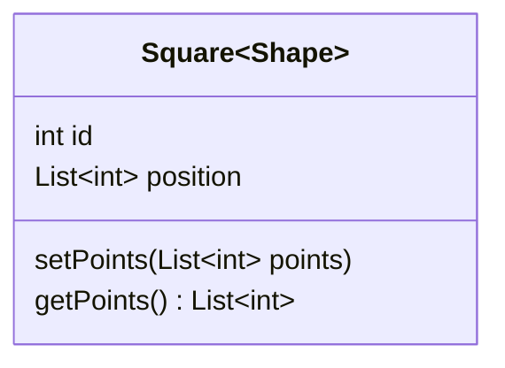
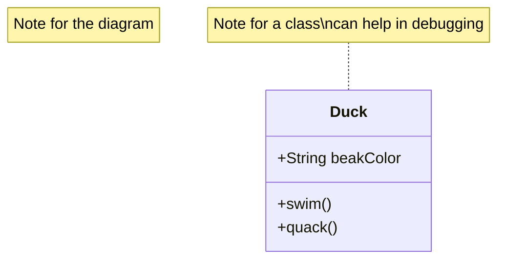
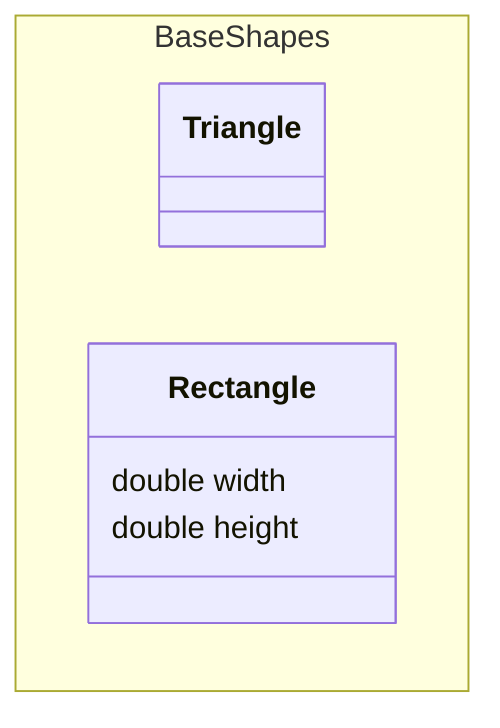
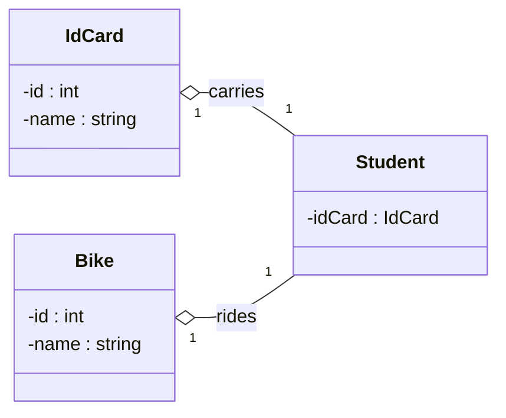

# Class diagrams

## Snippet

````mdx filename="Markdown"

````


## Class members
````mdx filename="Markdown"

````


## Return type

````mdx filename="Markdown"

````


## Visibility

- `+` Public
- `-` Private
- `#` Protected
- `~` Package/Internal
- `*` Abstract: `someAbstractMethod()*`, `someAbstractMethod() int*`
- `$` Static:
  - `someStaticMethod()$`
  - `someStaticMethod() String$`
  - `String someField$`


## Relationship

- `<|--`: Inheritance
- `*--`: Composition
- `o--`: Aggregation
- `-->`: Association
- `--`: Link (Solid)
- `..>`: Dependency
- `..|>`: Realization
- `..`: Link (Dashed)

````mdx filename="Markdown"

````


### Cardinality / Multiplicity

- `1` Only 1
- `0..1` Zero or One
- `1..*` One or more
- `*` Many
- `n` n (where n>1)
- `0..n` zero to n (where n>1)
- `1..n` one to n (where n>1)

````mdx filename="Markdown"

````


## Class Annotation

- `<<Interface>>` To represent an Interface class
- `<<Abstract>>` To represent an abstract class
- `<<Service>>` To represent a service class
- `<<Enumeration>>` To represent an enum

````mdx filename="Markdown"

````


## Generic Types

````mdx filename="Markdown"

````


## Class Note

````mdx filename="Markdown"

````


## Namespace

A namespace groups classes.

````mdx filename="Markdown"

````


## Render direction

Setting the direction of the diagram:

````mdx filename="Markdown"

````


