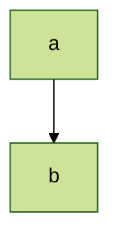

# Configurations

## Directives
Directives give a diagram author the capability to alter the appearance of a diagram before rendering by changing the applied configuration.

```
%%{
  init: {
    "theme": "dark",
    "fontFamily": "monospace",
    "logLevel": "info",
    "flowchart": {
      "htmlLabels": true,
      "curve": "linear"
    },
    "sequence": {
      "mirrorActors": true
    }
  }
}%%
```

Mermaid basically supports two types of configuration options to be overridden by directives:
- Top Level configurations: `theme`, `fontFamily`, `logLevel`, `securityLevel`, `startOnLoad`, `secure`
- Diagram-specific configurations: For each diagram there are specific configuration that will alter how that particular diagram looks and behaves.


## Theme

Available Themes:
- default - This is the default theme for all diagrams.
- neutral - This theme is great for black and white documents that will be printed.
- dark - This theme goes well with dark-colored elements or dark-mode.
- forest - This theme contains shades of green.
- base - This is the only theme that can be modified. Use this theme as the base for customizations.


Changing theme for a specific diagram:
````mdx filename="Markdown"

````


You can [customize a theme](https://mermaid.js.org/config/theming.html#customizing-themes-with-themevariables) by modifying `themeVariables` via `init` directive.