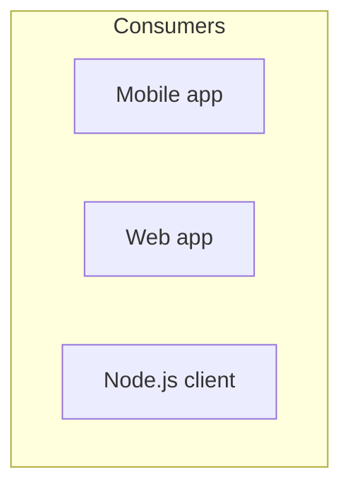

# Sub Graph

````mdx filename="Markdown"

```mermaid
graph TD
subgraph AA [Consumers]
A[Mobile app]
B[Web app]
C[Node.js client]
end
```
````


```mermaid
graph TD
subgraph AA [Consumers]
A[Mobile app]
B[Web app]
C[Node.js client]
end
```
