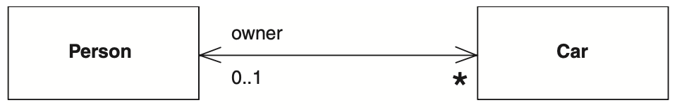

# Associations

## Overview

If two classes in a model need to communicate with each other, that can be represented by an association

Association is represented by a solid line between classes.

Association typically named using a verb or verb phrase which reflects the real world problem domain.

## Multiplicity

Multiplicity describes the allowable number of instances of one class that can be connected to an instance of another class through a given association.. 

Multiplicities are defined with a lower bound and an upper bound (e.g., `0..1`)

Terms that refer to the multiplicity:
- Optional implies a lower bound of `0`.
- Mandatory implies a lower bound of `1` or possibly more.
- Single-valued implies an upper bound of `1`.
- Multivalued implies an upper bound of more than `1`, usually `*`.

### Examples

A single student can associate with multiple teachers:

Every Instructor has one or more Students:

We can also indicate the behavior of an object in an association using role names:

## Aggregation

A special type of association.

Object of one class "owns" object of another class.

The child can exist independently of the parent. Example: delete the `Classroom` and the `Students` still exist.

The relationship is displayed as a solid line with a **unfilled** diamond at the association end, which is connected to the class that represents the aggregate.

- `Class2` is part of `Class`
- Delete `Class` and `Class2` still exist

## Composition

A special type of aggregation.

The child cannot exist independent of the parent. Parts are destroyed when the whole is destroyed. Example: rooms don't exist separate to a House.

The relationship is displayed as a solid line with a **filled** diamond at the association end, which is connected to the class that represents the whole or composite.

- Objects of `Class2` live and die with `Class`.
- `Class2` cannot stand by itself.

## Dependency

A special type of association.

An object of `Class` might use an object of `Class2` in its method. Object of `Class2` is not stored in any field.

The relationship is displayed as a dashed line with an open arrow.

- The `Person` class might have a `hasRead` method with a `Book` parameter that returns `true` if the person has read the book

## Bidirectional Associations

There can be an arrow indicating the navigation direction (unidirectional associations).

If an arrow is on both sides (or no arrows at all), the association is known as a bidirectional association.

A bidirectional association implies that if you follow both properties, you should get back to a set that contains your starting point.

For example, if I begin with a particular car, find its owner, and then look at its owner's cars, they should be a set that contain the car that I started from.

