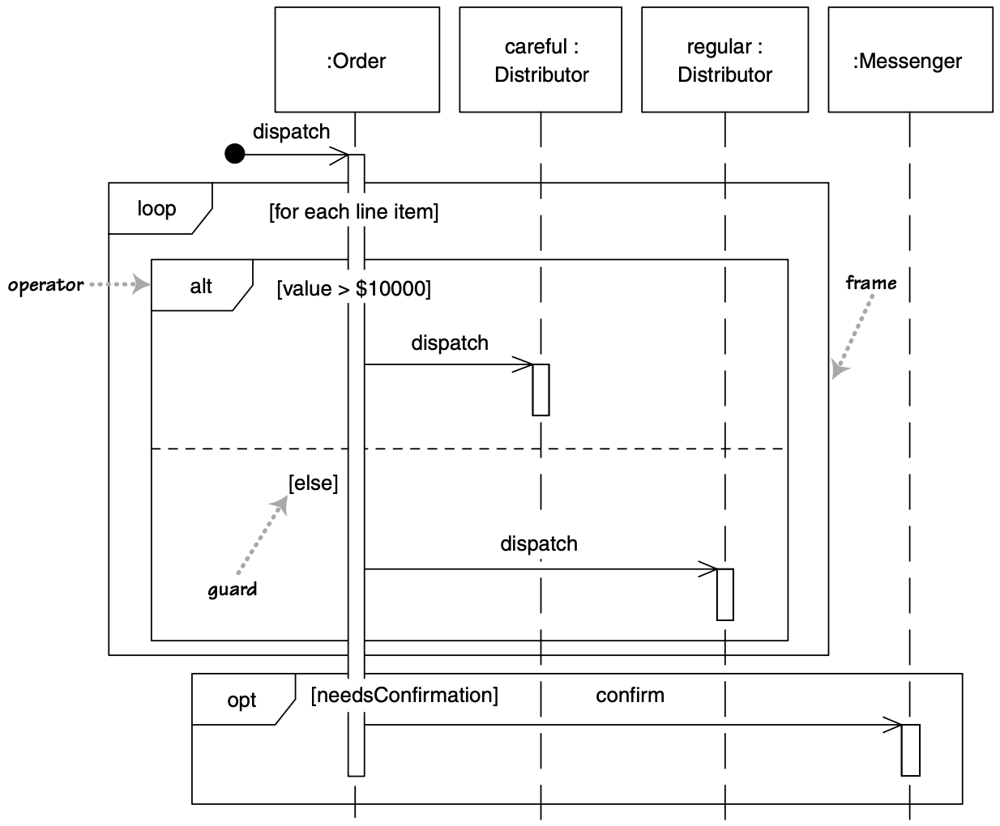

# Sequence Diagrams

## Overview

Sequence diagrams show the collaborations of several objects and the messages that are passed between these objects within a single use case.


## Use cases

Represent the details of a UML use case.

Model the logic of a sophisticated procedure, function, or operation.

See how objects and components interact with each other to complete a process.

Plan and understand the detailed functionality of an existing or future scenario.


## Components

### Object symbol

Represents a class or object.

Name in the box can follow the format: `object name: class name`

Class attributes should not be listed in this shape.


### Activation box

Represents the time needed for an object to complete a task.

The longer the task will take, the longer the activation box becomes.


### Actor symbol

Shows entities that interact with or are external to the system.


### Package symbol

Contain interactive elements of the diagram.

Also known as a frame.


### Lifeline symbol

Represents the passage of time.

Extends downward.

Shows the sequential events that occur to an object during the charted process.

Lifelines may begin with a labeled rectangle shape or an actor symbol.


### Loop symbol


### Alternative symbol

Used to model if/then scenarios.

To represent alternatives, use the labeled rectangle shape with a dashed line inside.


## Message Symbols

Symbols show how information is transmitted between objects. 

They can be thought of as methods provided by the object.

### Synchronous message symbol

When a sender must wait for a response to a message before it continues. The diagram should show both the call and the reply.


### Asynchronous message symbol

Asynchronous messages don't require a response before the sender continues.

Only the call should be included in the diagram.


### Asynchronous return message symbol

Represented by a dashed line with a lined arrowhead.


### Asynchronous create message symbol

This message creates a new object.


### Delete message symbol

This message destroys an object.


## Examples

### Modeling a class method

Pseudocode for a method `dispatch` of `Order` class:
```
procedure dispatch:
  foreach (lineitem):
    if (product.value > $10K):
      careful.dispatch
    else:
      regular.dispatch
    end if
  end for
  
  if (needsConfirmation):
    messenger.confirm
end procedure
```




### ATM systems

Process of patrons to access their bank accounts


